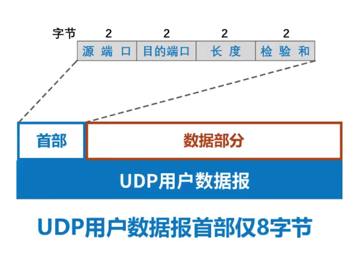
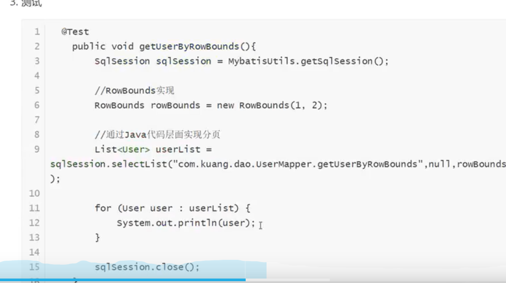
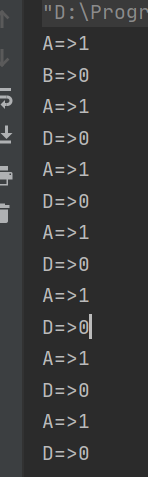
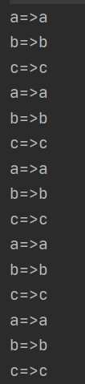
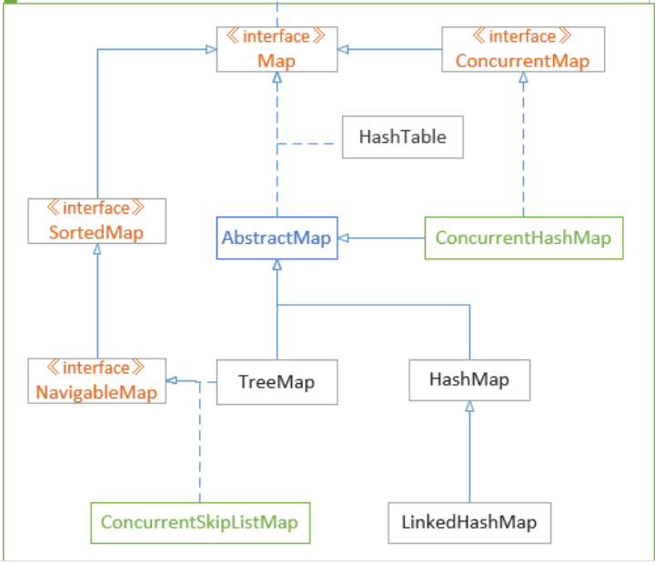

# 面试常考题

## JAVA

### 三个基本特性

- 封装

  > 同一类事物的共性（属性和方法）封装到一个类中（bean, pojo）

- 继承

  > 子类可以访问父类的非私有化成员变量，若要访问父类的私有成员变量，可以通过super.get()来获取

- 多态

  > 多态指的是对象的多种形态，多态有引用多态和方法多态。多态存在的三个必要条件：继承、重写、父类引用指向子类对象。Parent p = new Child()。多态方式调用方法时，首先检查父类中是否有该方法，如果没有，则编译错误；如果有，再去调用子类的同名方法。


### equals和==

> 1. java数据类型分为:
>
> ​    ***** **基本数据类型**
>
> ​    ***** **引用数据类型**
>
> 2.对于"=="
>
> ​    *用于基本数据类型相互比较. 比较二者的值是否相等.
>
> ​    *用于引用数据类型相互比较. 比较二者地址是否相等.
>
> ​    *不能用于基本数据类型与引用型比较.
>
> 3.对于"equals":
>
> ​    \* 不能用于基本数据类型比较(因为这是一个方法, 继承自object).
>
> ​    *用于进行对象的比较, 比较二者的引用地址是否相同.
>
> ​    *但是由于String重写了equals方法，所以比较的是两者的内容
>
>  4.特殊情况:
>
> ​    1)数值型基本类型和数值型类会存在**自动装箱**和**自动拆箱**.
>
> ​    2)字符串会以常量形式存在, 如果多个字符串变量值相同, 则他们指向同一个地址.
>
> ​    3)数值类型会存在**类型自动转换**.
>
> char[] 类型的不能和String类型进行equals比较，因为这两个不是同一个类型的，在anObject instance of String这一步为止就进行不下去了。
>
> String s = "hello"；String t = "hello"； 
>
> s==t 返回true 因为s会在栈中生成hello字符串，存入字符串常量池中，t创建的时候，首先会去常量池中看看有没有相同的字符串，有的话就直接引用，没有才创建。

### sychronized是如何保证可见性的

sychronized可以用在方法上，也可以用在代码块上

实例

```java
public class TestSyn {
    public synchronized void func1() {
        System.out.println(Thread.currentThread().getName());           
    }

    public void func2() {
        synchronized (this) {
            System.out.println(Thread.currentThread().getName() + this.getClass());
        }
    }
}
```

首先javac TestSyn.java 编译一下

然后javap -v TestSyn.class对字节码进行反编译


javac在编译的时候，会生成对应的monitorenter和monitorexit对应同步代码块的进入和退出。为什么有两个monitorexit是因为为了保证抛异常的情况下也能释放锁，防止死锁。所以，javac为同步代码快添加了一个隐式的try-finally,在finally中会调用monitorexit来释放锁。

对于修饰方法的代码反编译，也就是func1,可以看到有一个ACC-SYNCHRONIZED标识符，JVM会把这个方法视为同步方法。对于func2，也就是修饰代码块的，可以看到没有了ACC-SYNCHRONIZED标识符，而是出现了monitorenter和monitorexit。

这两种方法本质上都是获取监视器锁monitor。

### final修饰符

final可以用来修饰类、方法和变量，必须赋初值，不然会报错。

- 修饰类：表示这个类无法被继承，而且这个类中所有的方法也会被隐式地指定为final方法。像String、Integer类，都是final修饰的类。
- 修饰方法：表示这个方法不能被子类覆盖（override)，其实类的private方法也会被隐式地指定为final方法
- 修饰变量：如果是基本变量，说明这个变量在初始化之后就不能被更改，如果是引用变量，则在对其初始化之后就不能让其指向另一个对象。不过虽然不能指向其他对象，但是对象的内容是可以变的。

### static修饰符及加载顺序

static可以用来修饰类的成员方法、成员变量、代码块

- 修饰类的成员方法：被static修饰的成员方法叫做静态方法，不依赖于任何对象就能访问。但是在静态方法里面不能访问类的非静态成员变量或方法，因为非静态成员变量或方法是依赖于对象的。但是非静态的成员方法可以访问静态的成员方法或变量。不能用this去调用，因为this只针对对象的。不能修饰构造方法。
- 修饰类的成员变量：修饰的成员变量叫做静态变量，和非静态变量的区别是：静态变量是被所有的对象共享的，在类加载的时候被初始化，只初始化一次，在内存中只有一个副本；而非静态变量是对象拥有的，也就是说每new一个对象，就会初始化一次，在内存中拥有多个副本且互不影响。静态成员变量可以在非静态成员方法中用this去访问。
- 修饰代码块：被修饰的代码块会在类加载的时候被初始化，所以很多只需要一次初始化操作的代码可以被static修饰，不然每new一次对象就进行一次初始化，效率不高。

加载顺序：

- 如果类没被加载过

  > 1. 父类的静态代码块和静态变量初始化（静态代码块和静态变量的执行顺序只和代码顺序有关）
  > 2. 子类的静态代码块和静态变量初始化
  > 3. 父类的实例变量初始化
  > 4. 父类的构造函数
  > 5. 子类的实例变量初始化
  > 6. 子类的构造函数

- 如果类已经被加载过了，那么静态代码块和静态变量不用重复执行，再创建类对象的时候，只执行与实例相关的变量初始化和构造方法。

### 字面常量和符号常量

- 字面常量指的是可以用字符串表示的值，包括整型常量（1,2,3）、字符型 常量（a,b,c)、字符串常量(abc,hello)。 比如说int i= 1,在这里，i是变量，1是字面常量，
- 符号常量：用final修饰。 比如说final double PI=3.1315， PI就是符号常量。

### final和private

private是访问权限修饰符，用private修饰的成员或方法，只能在类的内部被访问，类的外部访问不到。

final修饰类，表示类不能被继承；修饰变量，表示变量不能被更改；修饰方法，表示方法不能被覆盖，也就是不能被重写。

用final修饰的方法是可以在类外部被访问的，final和private修饰的方法都不能被重写。这就是final和private的最大的区别。

## 计网

### OSI七层模型

- 应用层

  > 各种应用程序协议，比如http, ftp, smtp, pop3，RTP，其中，http和ftp需要TCP的服务， DNS和RTP需要UDP的服务

- 表示层

  > 信息的语法语义， 加密解密

- 会话层

  > 不同机器上的用户之间建立或管理会话

- 传输层

  > 接收上一层的数据，在必要的时候分割数据，传给网络层。维护端到端的连接。TCP，UDP

- 网络层

  > 控制子网的运行，如逻辑编制、分组传输、IP选址，路由选择。 IP/IPV6  ，ICMP。 路由器。

- 数据链路层

  > 物理寻址，把物理层的原始比特流转成逻辑传输线路。提供介质访问和链路管理。 ARP。网桥，交换机。

- 物理层

  > 原始比特流传输。网卡，网线，中继器，调制调节器。


### DNS

查看本地hosts文件：C:\Windows\System32\drivers\etc


DNS在应用层上，通过UDP运行，端口号53。

通过nslookup <域名> 去查找对应的IP


 可以看到两个地址： 36.152.44.96， 36.152.44.95

以新浪的域名 mail.sina.com为例


> - 级别最高的顶级域名写在最右边，级别最低的域名写在最左边；
> - 域名中的标号都由英文字母和数字组成，每一个标号不超过63个字符；
> - 英文字母不区分大小写，也就是说 mail 和 MAIL 在域名中是等效的；
> - DNS既不规定一个域名需要包含多少个下级域名，也不规定每一级域名代表什么意思；
> - 各级域名由上一级的域名管理机构管理，而最高的顶级域名则由ICANN进行管理，这种方式可以确保每一个域名在整个互联网范围内都是唯一的。


1. 单个DNS服务器

   > 从理论上来说，整个互联网可以只使用一个 DNS 服务器，该服务器包含所有的映射，客户直接将所有查询发往一个 DNS 服务器，同时该 DNS 服务器直接对所有的查询客户做出响应。但是它并不适用于当今庞大的互联网，这种设计含有以下缺陷：
   >
   > - 单点故障：该服务器故障，整个互联网崩溃
   > - **通信容量**。单个 DNS 服务器不得不处理所有的 DNS 查询，这很容易造成拥塞现象。
   > - **远距离的集中式数据库**。单个 DNS 服务器无法照顾到所有地区的用户，当用户距离 DNS 服务器非常遥远时，很容易造成严重的时延。
   > - **维护**。单个 DNS 服务器为所有互联网主机保留记录，这将导致该数据库异常庞大，对该数据库进行的任何修改操作将变得异常困难，维护成本高昂。

2. 分布式服务器

   

   本地服务器-权威服务器-顶级域名服务器-根服务器

3. 工作流程：递归查询+迭代查询

   > 主机到本地DNS服务器是递归查询，本地DNS后续查询是迭代查询。
   >
   > 如www.google.com
   >
   > 本地DNS先到根服务器，根域名服务器告诉本地服务器接下来去往com这个顶级域名服务器查找，com DNS服务器会告知本地 DNS服务器接下来应该向权威DNS服务器 [google.com](http://google.com/) 查询，接下来返回IP地址跟本地服务器。

   

### TCP和UDP





|            | TCP                                           | UDP                    |
| ---------- | --------------------------------------------- | ---------------------- |
| 是否连接   | 面向连接                                      | 面向无连接             |
| 传输可靠性 | 可靠                                          | 不可靠                 |
| 应用场合   | 少量数据                                      | 大量数据               |
| 速度       | 慢                                            | 快                     |
| 应用       | SSH文件传输、HTTP、HTTPS、FTP传输，面向字节流 | QQ视频、TFTP，面向报文 |

tcp优点

> tcp的可靠性在于，在传递数据之前，会有三次握手来建立连接，数据传递时，有确认、窗口、重传、拥塞控制机制，传完之后，会断开连接节约系统资源。

tcp缺点

> 慢，效率低，占用系统资源高，容易被攻击。每个TCP连接都会占用CPU，而且TCP的确认机制和三次握手机制，容易被攻击，比如说DOS，DDOS，CC等攻击。

UDP优点

> 快，没有重传、拥塞等机制，是无状态的传输协议，由于没有了那些机制，会比TCP稍微安全一点，但是也无法避免受到攻击，比如UDP FLOOD攻击。

UDP缺点

> 不可靠，在网络质量不好的情况下，容易出现丢包现象。

TCP为什么是可靠的

> 1. ACK和超时重传机制
> 2. 数据排序
> 3. 流量控制
> 4. 拥塞控制：慢启动，拥塞避免，快速重传，快速恢复


### http1.0和http1.1

HTTP1.0 规定浏览器和服务器只保持短暂的连接，浏览器的每次请求都要与服务器建立一个新的连接，服务器完成请求处理后立即断开TCP连接，服务器不跟踪客户也不记录过去的请求。

HTTP1.1则支持持久连接，即长连接。在同一个TCP连接中可以传送多个HTTP请求和响应，多个请求和响应可以重叠。持久连接也需要增加新的请求头来帮助实现，比如connection请求头为keep-alive的时候，客户端会通知服务端返回本次请求后就保持连接，connection为close的时候，客户端通知服务端返回本次请求后断开连接。1.1还提供了与身份认证、状态管理、cache缓存机制相关的请求头和响应头。

1.0会话方式

> 1. 建立连接
> 2. 发出请求
> 3. 回应请求
> 4. 断开连接

### TCP拥塞控制

拥塞窗口作为发送窗口，swnd= cwnd， 网络拥塞程度大的话，cwnd要小一点，反之可以大一点。

当cwnd<ssthresh（慢开始门限）,用慢开始算法

当cwnd>ssthresh,用拥塞避免算法

当cwnd=ssthresh，慢开始和拥塞避免算法都行


发送方给接收方数据报文，接收方回复发送方确认报文段，这样一个来回的时间就是RTT。

在tcp双方建立逻辑链接关系时， 拥塞窗口cwnd的值被设置为1，还需设置慢开始门限ssthresh,在执行慢开始算法时，发送方每收到一个对新报文段的确认时，就把拥塞窗口cwnd的值加一，然后开始下一轮的传输，当拥塞窗口cwnd增长到慢开始门限值时，就使用拥塞避免算法。

1. 慢启动

   > 指的是一开始传输的报文少，而不是启动慢。
   >
   > cwnd按指数增长。一开始cwnd为1，所以swnd也是1，发送过去一个数据报文，收到一个确认报文，因此cwnd+1=2, 此时swnd=2, 可以传两个过去了，一次RTT后，swnd=cwnd=2+2=4, 以此类推。

2. 拥塞避免

   > cwnd只能线性增长，每次只能+1，以此减少拥塞。

3. 快速重传

   > 发送方发送1号数据报文段，接收方收到1号报文段后给发送方发回对1号报文段的确认，在1号报文段到达发送方之前，发送方还可以将发送窗口内的2号数据报文段发送出去，接收方收到2号报文段后给发送方发回对2号报文段的确认，在2号报文段到达发送方之前，发送方还可以将发送窗口内的3号数据报文段发送出去。

4. 快速恢复


## 操作系统

### 进程和线程的区别

- 进程是资源分配的最小单位，每个进程都有独立的代码和数据空间（进程上下文），进程间的切换会产生比较大的开销，因为系统要为之分配和回收资源
- 线程是CPU调度的最小单位，不拥有系统资源，但是线程之间共享进程资源。
- 进程之间不会相互影响，但是线程挂了，会影响进程。
- 线程可以创建和撤销另一个线程
- 进程和进程、线程和线程之间都可以并发执行

## 进程间的通信方式

- 匿名管道
- 命名管道
- 消息队列(Message Queue)
- 共享内存（shared memory)
- 信号量(semaphore, pv操作)
- 套接字（socket)
- 信号（signal)

# 算法&数据结构

## 排序

### 快排

最差复杂度：O(n^2), 最好复杂度：O(nlogn)

```java

public class QuickSort {
    public static void quickSort(int[]arr, int low,int high){
        if(low>=high)
            return;
        int left=low, right=high;
        int base=arr[left];
        while(left<right){
            //先从右往左找比base小的数
            while (left<right&&arr[right]>=base){
                right--;
            }
            if(left<right){
                arr[left++]=arr[right];//填坑，然后更新下标
            }
            //在从左往右找比base大的
            while (left<right&&arr[left]<base){
                left++;
            }
            if(left<right){
                arr[right--]=arr[left];//填坑
            }
        }
        //最后跳出循环条件是left>=right
        arr[left]=base;
        quickSort(arr,low,left-1);
        quickSort(arr,left+1,high);
    }

    public static void main(String args[]){
        int[] arr ={2,1,6,3,4,7,0,8,9,5};
        quickSort(arr,0,arr.length-1);
        for (int i : arr) {
            System.out.println(i);
        }
    }


}

```


## 图

### 存储

#### 邻接表

邻接点概念：通过其中一个定的概念，可以直接找到另一个顶点，称他们互为邻接点。

# MySQL

## 语法

### join

- 左连接（left join）
- 右连接（right join）
- 内连接（inner join）
- 全外连接（full join）

测试：现有两张表，user和account


- 左连接

  ```sql
  select * from user a LEFT JOIN account b on a.username=b.username
  ```

  

可以看到，左连接是以左边为基础，即会读取左表的所有记录，返回包括左表中的所有记录和右表中连接字段相等的记录。没有匹配到的，用null填充。

- 右连接

  ```sql
  select * from user a right JOIN account b on a.username=b.username
  ```

  


- 内连接

  ```sql
  select * from user a inner JOIN account b on a.username=b.username
  ```

  

  只返回两表中连接字段相等的行

- 全外连接

  ```sql
  select * from user a left join account b on a.username=b.username
  UNION 
  select * from user a right join account b on a.username=b.username
  ```

  由于MySQL没有full join，所以可以用union连接

  

### REGEXP

筛选名字中含有数字的行

```sql
select * from user where name REGEXP '[0-9]'
```


## 事务

### ACID

1. 原子性：事务是数据库的逻辑工作单位，必须是原子工作单位，对于其数据修改，要么全部执行，要么全部不执行
2. 一致性：事务在完成时，必须是所有的数据都保持一致状态
3. 隔离性：同一时间，只允许一个事务请求同一个数据，不同事务之间彼此没有干扰。比如a在用一张银行卡取钱，取钱的过程中，B不能有任何动作。
4. 持久性：事务完成之后，事务对数据库的所有更新将被保存到数据库，不能回滚

### 隔离级别

| 事务隔离级别                           | 脏读 | 不可重复读 | 幻读 |
| -------------------------------------- | ---- | ---------- | ---- |
| 读未提交（read-uncommitted）           | 是   | 是         | 是   |
| 不可重复读，读已提交（read-committed） | 否   | 是         | 是   |
| 可重复读（repeatable-read）            | 否   | 否         | 是   |
| 串行化（serializable）                 | 否   | 否         | 否   |

读未提交：顾名思义就是一个事务读到了另外一个事务没有提交的数据，会产生脏读。

不可重复读（读已提交）：我觉得还是读已提交比较好理解，就是说一个事务要等另一个事务提交之后才能读取数据。

可重复读：在读取数据（事务开启）的时候，不允许再修改数据，也就是update操作。前面的不可重复读，是允许在读取的时候修改数据，所以两次读取结果数据不一致。还是一样的例子，你去刷卡的时候，也就是查询了余额，这期间，你妻子不能转出钱。可以解决不可重复读的问题，但是仍旧会有幻读的问题。

串行化：是最高的事务隔离级别，事务串行化顺序执行，可以避免脏读、不可重复读、幻读。但是效率比较低下。


mysql的默认隔离级别是可重复读，另外大多数都是不可重复读。

### 并发问题

1. 脏读

   > 脏读就是，比如说老板给你打钱，不小心多按了一个0，但是事务没有提交，你那时候看到你的工资多了一个0，然后老板警觉，立马回滚了还没有提交的事务，实际上你拿到的是老板提交后的工资，但是你看到的却是回滚之前没提交的数字，读到的是脏数据。
   >
   > 解决方法：不可重复读，也就是读已提交。

2. 不可重复读（读已提交）

   > 当你去商场刷卡的时候，卡里显示还是有钱的，但是你老婆说家里有急事，一下子把钱全部转光了，pos机刷卡的时候，就显示余额为零了。虽然避免了脏读，因为读到的是你老婆提交事务后的数据，但是你会觉得很奇怪，明明卡里是有钱的。这种在一个事务内两次相同的查询返回不同的结果，就叫不可重复读。
   >
   > 解决方法：可重复读

3. 幻读

   > 幻读对应的是插入Insert操作，而前面的不可重复读是对应的update操作，可重复读避免了读取时的update操作，但是没能避免读取时的insert操作。例子：你去商场买了个东西，你老婆对你的消费记录扫描的时候（此时事务还没提交），看到的也确实是只有一条消费记录，但是后来你又买了个东西，即Insert了一个新的消费记录，此时你老婆要打印记录（事务已提交），却看到两条消费记录，觉得自己出现了幻觉，这就叫幻读。
   >
   > 解决方法：serializable


## 索引

索引的优点：索引可以大大提高MySQL的检索速度

索引的缺点：虽然索引大大提高了查询速度，同时却会降低更新表的速度，如对表进行INSERT、UPDATE和DELETE。因为更新表时，MySQL不仅要保存数据，还要保存一下索引文件。建立索引会占用磁盘空间的索引文件。

### 表级锁和行级锁

myisam只支持表级锁，而innodb支持表级锁和行级锁。

触发：当where 条件不含索引，触发的是表级锁，当条件中含有索引，触发的是行级锁。

### 二级索引

#### 单列索引

在单个列上创建索引

创建索引时，你需要确保该索引是应用在 SQL 查询语句的条件(一般作为 WHERE 子句的条件)。

#### 组合索引（联合索引，复合索引）

不懂为什么组合索引有那么多名字，搞不清。。

在多个列上建立索引。用组合索引的时候，最好将条件顺序按照索引的顺序：

```
比如说创建一个索引：  create index idx1 on table1(col2,col3,col5)
最好查询的时候是这样： select * from table1 where col2=A and col3=B and col5= C
如果按照其他的顺序，可能将不会使用索引。
```

单列索引和组合索引：

如果说一张表中已经有个复合索引on (col1,col2) 就没有必要同时建立一个单索引on col1了。但是如果先有单索引on col1， 为了适应查询的需要，可以再添加一个复合索引on ( col1,col2).

合并索引和组合索引：

如果说在多个列上单独添加索引，比如说create index idx1 on table1(col1),  create index idx2 on table2(col2)

这种不是属于组合索引的范畴，组合索引是在多列创建同一个索引，比如create index idx1 on table1(col1,col2)。在查询的时候如果使用到这几个单独添加了索引的列，他们叫做合并索引。

合并索引，需要在多个索引表之间跳转，速度比较慢。

组合索引不需要在多个索引表之间跳转，因为它不需要像索引合并那样对索引的rowID进行合并比较

#### 深入理解联合索引（a,b,c)

条件：需要加索引的字段得在where条件中，数据量少的字段不需要加索引，如果where条件中是or关系，那么加索引不起作用。符合最左原则。

也就是说一个复合索引（a,b,c), 可以支持a, ab, ac, abc ,由于优化器可以自动调整and前后的顺序，所以ba,ca,bca,cba也都会用到索引，其他的不会。

### 全文索引

比如说一张数据表，里面有文章id，文章内容，如果你想在整张表里找文章内容中含有XXX的文章，如果用sql语句写，效率很差。但是用了全文索引之后，只需要到索引文件里面去查找，索引文件里面有文章关键词对应的文章id,找到文章关键词之后就可以找到文章id了。

# Redis

狂神视频看完了前p17节，

1. 内存存储、持久化（rdb,aof)
2. 高速缓存
3. 发布订阅系统

redis是单线程的，用c语言写的，每秒qps为10w+。

为什么单线程还这么快？

> 首先，高性能的服务器不一定是多线程的，多线程不一定比单线程效率高，因为多线程会有cpu的上下文切换。redis将所有的数据全部放在内存中，单线程去操作效率最高，因为没有上下文切换。

## 基础

https://redis.io/

默认端口号：6379

默认数据库：16， 默认使用第0个

## 命令


是否存在某key

> exists key           //存在返回1，不存在返回-1

查看所有key

> keys *

选择数据库

> select <db>

清除数据库

> flushdb

清空 所有数据库

> flushall

设置过期时间

> expire name 20  //给name这个key设置过期时间为20秒，可以用ttl name来查看倒计时情况，-2表示这个key已经没了


```
127.0.0.1:6379> type age  //判断字段的类型
string
```


## windows安装

先启动redis-server.exe, 再启动redis-cli.exe


## 数据类型

### String

```java
127.0.0.1:6379> set k1 v1   //设置Kv键值对
OK
127.0.0.1:6379> get k1     //获取key值
"v1"
127.0.0.1:6379> strlen k1  //获取值长度
(integer) 2
127.0.0.1:6379> append k1 hello //在值后面附加，如果k1不存在，则相当于set
(integer) 7
127.0.0.1:6379> strlen k1
(integer) 7
```

```java
127.0.0.1:6379> set view 0  //设置初始值0
OK
127.0.0.1:6379> get view
"0"
127.0.0.1:6379> incr view  //自增 i++
(integer) 1
127.0.0.1:6379> decr view   //自减 i--
(integer) 0
127.0.0.1:6379> incrby view 10  //增10
(integer) 10
127.0.0.1:6379> incrby view 10
(integer) 20
127.0.0.1:6379> decrby view 5  //减5
(integer) 15
```

```java
//setex(set with expire 设置kv及过期时间)
//setnx(set if not exist 如果key不存在，设置成功， 如果key已经存在，则设置失败)
127.0.0.1:6379> SETEX mykey 30 hello
OK
127.0.0.1:6379> get mykey
"hello"
127.0.0.1:6379> ttl mykey
(integer) 16
127.0.0.1:6379>
```

```java
127.0.0.1:6379> mset k1 v1 k2 v2 k3 v3  //批量set
OK
127.0.0.1:6379> mget k1 k2 k3          //批量get
1) "v1"
2) "v2"
3) "v3"
127.0.0.1:6379> MSETNX k1 v3 k4 v4     //批量set,遵循if not exist，原子性操作，0表示不成功
(integer) 0
127.0.0.1:6379> MSETNX k4 v4 k1 v2 
(integer) 0
127.0.0.1:6379> keys *
1) "k2"
2) "k1"
3) "k3"
```

```java
//set 一个对象，field是这个对象的值（用json格式保存）
//set user:{id}:{field}
127.0.0.1:6379> set user:1:name luyiyi
OK
127.0.0.1:6379> get user:1
(nil)
127.0.0.1:6379> get user:1:name
"luyiyi"
127.0.0.1:6379> set fruit:1:name apple
OK
127.0.0.1:6379> get fruit:1:name
"apple"
    
//getset
127.0.0.1:6379> getset object  a //先get，然后set，所以一开始返回0
(nil)
127.0.0.1:6379> get object      //再次get就有值了
"a" 
```

### List

```java
############################# LPUSH
127.0.0.1:6379> LPUSH list 1 //L表示是从左边push
(integer) 1
127.0.0.1:6379> LPUSH list 2
(integer) 2
127.0.0.1:6379> LPUSH list 3
(integer) 3
127.0.0.1:6379> get list
127.0.0.1:6379> LRANGE list 0 -1    //【0，-1】,表示取所有的元素
1) "3"
2) "2"
3) "1"    
############################# RPUSH
127.0.0.1:6379> RPUSH list 4     //R表示是从右边push
(integer) 4
127.0.0.1:6379> LRANGE list 0 -1  //这里的L表示list
1) "3"
2) "2"
3) "1"
4) "4"
127.0.0.1:6379> LRANGE list 0 -1    
1) "3"
2) "2"
3) "1"
4) "4"
############################# LPOP
127.0.0.1:6379> LPOP list //表示弹出左边第一个值
"3"
############################# RPOP
127.0.0.1:6379> RPOP list //表示弹出右边第一个值
"4"
127.0.0.1:6379> LRANGE list 0 -1
1) "2"
2) "1"
127.0.0.1:6379> LINDEX list 0 //通过下标获取值
"2"
127.0.0.1:6379> LINDEX list 1
"1"
############################# LLEN
127.0.0.1:6379> LLEN list  //list长度
(integer) 2
127.0.0.1:6379> LRANGE list 0 -1  
1) "2"
2) "1"
#############################   LREM
127.0.0.1:6379> LREM list 1 2 //移除某个数量的value
(integer) 1
127.0.0.1:6379> LRANGE list 0 -1
1) "1"
############################# LTRIM
127.0.0.1:6379> LRANGE list 0 -1
1) "4"
2) "3"
3) "2"
4) "1"
127.0.0.1:6379> LTRIM list 1 2  //修剪list，和lrange不同，ltrim会使list内容发生改变
OK
127.0.0.1:6379> LRANGE list 0 -1 
1) "3"
2) "2"
############################# LPOPRPUSH
    127.0.0.1:6379> lpush list 1
(integer) 1
127.0.0.1:6379> lpush list 2
(integer) 2
127.0.0.1:6379> lpush list 3
(integer) 3
127.0.0.1:6379> LRANGE list 0 -1
1) "3"
2) "2"
3) "1"
127.0.0.1:6379> RPOPLPUSH list list1 //就是list中用rpop,然后lpush到新的list里
"1"
127.0.0.1:6379> RPOPLPUSH list list1
"2"
127.0.0.1:6379> LRANGE list 0 -1
1) "3"
127.0.0.1:6379> LRANGE list1 0 -1
1) "2"
2) "1"
127.0.0.1:6379> LINSERT list1 before 2 3 //在list1中的2前面插入3
(integer) 3
127.0.0.1:6379> LRANGE list1 0 -1
1) "3"
2) "2"
3) "1"
    
```


### Set

```java
127.0.0.1:6379> SADD name jack eris paul  
(integer) 3
127.0.0.1:6379> SMEMBERS name  //返回set集合中具体的元素
1) "paul"
2) "eris"
3) "jack"
127.0.0.1:6379> SCARD name  //返回set集合元素数量
(integer) 3
127.0.0.1:6379> SRANDMEMBER name 2  //随机返回指定个数的元素
1) "jack"
2) "eris"
127.0.0.1:6379> SRANDMEMBER name 1
1) "paul"
```

```java
//差集 SDIFF key1 key2  以key1为基础，取key1 key2 两个的差集
//交集 SINTER key1 key2 
//并集 SUnion key1 key2
//判断一个元素是否在set集合中， sismember key member
//将某个元素从set集合中remove掉 srem key member
```


### Hash

key-Map

```java
127.0.0.1:6379> HSET person name lyy
(integer) 1
127.0.0.1:6379> HSET person age 18
(integer) 1
127.0.0.1:6379> HGETALL person
1) "name"
2) "lpq"
3) "age"
4) "18"
```


### Zset

在set的基础上，多了一个值，用来排序

```java
127.0.0.1:6379> zadd rank 1 one  
(integer) 1
127.0.0.1:6379> zadd rank 2 two 3 three
(integer) 2
127.0.0.1:6379> ZCARD rank
(integer) 3
127.0.0.1:6379> ZRANGE rank 0 -1
1) "one"
2) "two"
3) "three"
```

```java
127.0.0.1:6379> zadd salary 2500 a 500 b 4000 c
(integer) 3
(0.54s)
127.0.0.1:6379> ZRANGE salary 0 -1
1) "b"
2) "a"
3) "c"
127.0.0.1:6379> ZRANGEBYSCORE salary 2000 5000
1) "a"
2) "c"
```

## 缓存穿透、击穿、雪崩

读的请求，会先去缓存中查，查不到的话再去数据库里查。

1. 缓存穿透

   > 用户要查询一个数据的时候，发现redis内存数据库没有，也就是缓存没有命中，于是会向持久层数据库中查询。如果持久层数据库中也没有的话，本次查询失败。当有很多用户的时候（秒杀），都去请求持久层数据库的话，会给数据库造成很大的压力。
   >
   > 解决方案：布隆过滤器

2. 缓存击穿

   > 热点数据过期的时候，在失效的期间，持续的大并发穿破缓存，直接请求数据库，造成数据库瞬间压力过大。
   >
   > 解决方案：加锁 

3. 缓存雪崩

   > 在某一个时间段，缓存集中过期失效，redis宕机。比如双十二的时候大量的东西加在购物车里，如果缓存过期失效的话，压力都在数据库里，造成雪崩。
   >
   > 解决方案：数据预热，在正式部署之前，先把可能的数据先预先访问一遍，大量访问的数据就会加载到缓存中，在即将发生大并发访问前手动触发加载缓存不同的Key,设置不同的过期时间，让缓存失效的时间点尽量均匀。

# Vue

## 配置

首先在idea中下载插件

然后html中用cdn形式导入vue

```
<script src="https://cdn.bootcss.com/vue/2.5.2/vue.min.js"></script>

```


# JavaWeb

## servlet


所以说接口ServletConfig和Servlet默认是在GenericServlet中实现的

# Mybatis

在idea中加入以下代码，防止每次新建module java版本不一致

```java
        <plugins>
            <plugin>
                <groupId>org.apache.maven.plugins</groupId>
                <artifactId>maven-compiler-plugin</artifactId>
                <version>2.3.2</version>
                <configuration>
                    <source>1.8</source>
                    <target>1.8</target>
                </configuration>
            </plugin>
        </plugins>

```


## 第一个mybatis程序

### 搭建环境

搭建数据库

```
create database `mybatis`;

user `mybatis`;

create table `user`(
 `id` INT(20) NOT NULL PRIMARY KEY,
 `name` VARCHAR(30) DEFAULT null,
 `pwd` VARCHAR(30) DEFAULT null
 
)ENGINE = INNODB DEFAULT CHARSET= utf8;

INSERT into `user` (`id`,`name`,`pwd`) VALUES 
(1,'a','123456'),
(2,'b','123456'),
(3,'c','123456')
```

新建项目

1. 新建一个普通的maven项目

2. 删除src目录

3. 导入maven依赖

   ```
   <!--父工程 -->
       <groupId>com.lyy</groupId>
       <artifactId>mybatis-study</artifactId>
       <version>1.0-SNAPSHOT</version>
       <!--导入依赖-->
       <dependencies>
           <!--mysql驱动-->
           <dependency>
               <groupId>mysql</groupId>
               <artifactId>mysql-connector-java</artifactId>
               <version>5.1.47</version>
           </dependency>
           <!--mybatis-->
           <dependency>
               <groupId>org.mybatis</groupId>
               <artifactId>mybatis</artifactId>
               <version>3.5.2</version>
           </dependency>
           <!--junit-->
           <dependency>
               <groupId>junit</groupId>
               <artifactId>junit</artifactId>
               <version>4.12</version>
           </dependency>
   
   
   
       </dependencies>
   ```

### 创建模块

在项目名上右击new一个 module之后，父工程的pom文件里面会自动添加这个module。

- 编写核心配置文件

  ```
  <?xml version="1.0" encoding="UTF-8" ?>
  <!DOCTYPE configuration
          PUBLIC "-//mybatis.org//DTD Config 3.0//EN"
          "http://mybatis.org/dtd/mybatis-3-config.dtd">
  <!--configuration核心配置文件-->
  <configuration>
      <environments default="development">
          <environment id="development">
              <!--事务管理，默认用的是jdbc-->
              <transactionManager type="JDBC"/>
              <dataSource type="POOLED">
                  <property name="driver" value="com.mysql.jdbc.Driver"/>
                  <property name="url" value="jdbc:mysql://localhost:3306/mybatis?useSSL=false&amp;useUnicode=true&amp;characterEncoding=UTF-8"/>
                  <property name="username" value="root"/>
                  <property name="password" value="123"/>
              </dataSource>
          </environment>
      </environments>
  
  </configuration>
  ```

- 编写mybatis工具类

  ```
  //sqlSessionFactory 工厂模式-->sqlSession
  //需要看一下狂神对工厂模式的解析
  public class MybatisUtils {
      private static SqlSessionFactory sqlSessionFactory;
      //放static里面表示一开始就加载
      static{
          try {
              //使用mybatis的第一步，获取sqlSessionFactory对象
              String resource = "org/mybatis/example/mybatis-config.xml";
              InputStream inputStream = Resources.getResourceAsStream(resource);
               sqlSessionFactory = new SqlSessionFactoryBuilder().build(inputStream);
          } catch (IOException e) {
              e.printStackTrace();
          }
  
      }
  
      //既然有了sqlSessionFactory ,顾名思义，就可以获得sqlSession实例了
      //sqlSession完全包含了面向数据库执行sql命令所需的所有方法
      public static SqlSession getSqlSession(){
          return  sqlSessionFactory.openSession();
      }
  }
  ```


### 编写代码

- 编写实体类

  ```
  //实体类
  public class User {
      private int id;
      private String name;
      private String pwd;
  
      public User() {
      }
  
      public int getId() {
          return id;
      }
  
      public void setId(int id) {
          this.id = id;
      }
  
      public String getName() {
          return name;
      }
  
      public void setName(String name) {
          this.name = name;
      }
  
      public String getPwd() {
          return pwd;
      }
  
      public void setPwd(String pwd) {
          this.pwd = pwd;
      }
  }
  ```

- Dao接口

  ```
  public interface UserDao {
      List<User> getUserList();
  }
  ```

- 接口实现类（由原来的UserDaoImpl转变为一个Mapper.xml配置文件),

  ```java
  <!--namespace=绑定一个对应的dao/mapper接口,本来应该是给dao接口new 一个它的实现类，这边也就相当于实现dao中方法-->
  <mapper namespace="com.lyy.dao.UserDao">
      <!--select查询语句,这边的id也就是对应dao接口中的方法名-->
      <select id="getUserList" resultType="com.lyy.pojo.User">
      select * from mybatis.user;
      </select>
  </mapper>
  ```


### 测试

注意点：

> type interface com.lyy.dao.UserDao is not known to the MapperRegistry
>
> 关于资源过滤的事情，如果你的xml文件是放在java下面的resource下面，其实target文件夹里面是没有这个xml文件的，需要在pom文件中加上以下代码

```Java
<!--在build中配置resources, 来防止我们资源导出失败的问题-->
    <build>
        <resources>
            <resource>
                <directory>src/main/resources</directory>
                <includes>
                    <include>**/*.properties</include>
                    <include>**/*.xml</include>

                </includes>
                <filtering>true</filtering>
            </resource>
            <resource>
                <directory>src/main/java</directory>
                <includes>
                    <include>**/*.properties</include>
                    <include>**/*.xml</include>
                </includes>
     <filtering>true</filtering>
            </resource>
        </resources>
    </build>
```

可能会遇到的问题：

- 配置文件没有注册
- 绑定接口错误
- 方法名不对
- 返回类型不对
- Mavend

## CRUD

### 1.namespace

namespace中的包名要和dao/mapper接口的包名一直

### 2.select

选择、查询语句

1. id,就是对应的Namespace中的方法名， 要和接口中的方法一毛一样
2. resultType,sql语句执行的返回值， 要写全限定名，而且类型是泛型，比如List<User>, 不能写List<User>, 而要写的里面的泛型User
3. parameterType，参数类型, 可以省略

步骤：

1.编写接口

```java
//根据ID查询用户
    User getUserById(int id);
```

2.编写对应的mapper中的sql语句

```java
<select id="getUserById" parameterType="int" resultType="com.lyy.pojo.User">
        select * from mybatis.user where id= #{id}
    </select>
```

3.测试

```java
@Test
    public void getUserById(){
        SqlSession sqlSession = MybatisUtils.getSqlSession();
        UserMapper mapper = sqlSession.getMapper(UserMapper.class);
        User userById = mapper.getUserById(1);
        System.out.println(userById);
        sqlSession.close();
    }
```


### 3.Insert

```java
  <!--对象中的属性，可以直接取出来-->
    <insert id="addUser" parameterType="com.lyy.pojo.User">
        insert into mybatis.user(id,name,pwd) values(#{id},#{name},#{pwd});
    </insert>
```

测试

```java
    //增删改需要提交事务
    @Test
    public void addUser(){
        SqlSession sqlSession = MybatisUtils.getSqlSession();
        UserMapper userMapper = sqlSession.getMapper(UserMapper.class);
        int res = userMapper.addUser(new User(4,"哈哈","12333"));
        if(res>0)
            System.out.println("插入成功");

        //提交事务
        sqlSession.commit();
        sqlSession.close();

    }
```


### 4.update

```java
 <update id="updateUser" parameterType="com.lyy.pojo.User">
        update mybatis.user set name=#{name}, pwd=#{pwd} where id=#{id};
    </update>
```


### 5.delete

```java
<delete id="deleteUser" parameterType="int">
        delete from mybatis.user where id=#{id};
    </delete>
```


- 注意：增删改需要提交事务

### 6. 万能map

接口

```java
    //添加用户,参数以map的方式
    int addUserByMap(Map<String,Object> map);
```

xml

```java
    <insert id="addUserByMap" parameterType="map">
        insert into mybatis.user(id,pwd) values(#{userId},#{password});
    </insert>
```

测试

```java
    @Test
    public void addUserByMap(){
        SqlSession sqlSession = MybatisUtils.getSqlSession();
        UserMapper userMapper = sqlSession.getMapper(UserMapper.class);
        Map<String,Object> map = new HashMap<>();
        map.put("userId",5);
        map.put("password","123456");
        int res = userMapper.addUserByMap(map);
        if(res>0)
            System.out.println("插入成功");

        //提交事务
        sqlSession.commit();
        sqlSession.close();

    }
```

目的：可以进行批量的传参数，不用全部都传，传的是Map中的键，而不用和实体类属性字段一致，好处就是你可以传自己想要的参数，尤其是在参数很多的情况下，有些不需要传。

对象传参，直接在sql中取对象的属性 parameterType="map"

map传参，直接在sql中取出key parameterType="object"

多个参数用map, 或者注解

### 8.思考题

模糊查询

1. Java代码执行的时候，传递通配符%%

   ```java
   List<User> userList =mapper.getUserListByLike("%a%");
   ```

   ```java
    <select id="getUserListByLike" resultType="com.lyy.pojo.User">
        select * from mybatis.user where name like #{name};
       </select>
   ```

   

2. 在sql拼接中使用通配符

   ```java
   List<User> userList =mapper.getUserListByLike("a");
   ```

   ```java
    <select id="getUserListByLike" resultType="com.lyy.pojo.User">
        select * from mybatis.user where name like "%"#{name}"%";
       </select>
   ```

   

   


## 配置解析

### 核心配置文件

1. 配置文件 mybatis-config.xml
2. MyBatis 的配置文件包含了会深深影响 MyBatis 行为的设置和属性信息。 配置文档的顶层结构如下：
   - configuration（配置）
     - [properties（属性）](https://mybatis.org/mybatis-3/zh/configuration.html#properties)
     - [settings（设置）](https://mybatis.org/mybatis-3/zh/configuration.html#settings)
     - [typeAliases（类型别名）](https://mybatis.org/mybatis-3/zh/configuration.html#typeAliases)
     - [typeHandlers（类型处理器）](https://mybatis.org/mybatis-3/zh/configuration.html#typeHandlers)
     - [objectFactory（对象工厂）](https://mybatis.org/mybatis-3/zh/configuration.html#objectFactory)
     - [plugins（插件）](https://mybatis.org/mybatis-3/zh/configuration.html#plugins)
     - environments（环境配置）
       - environment（环境变量）
         - transactionManager（事务管理器）
         - dataSource（数据源）
     - [databaseIdProvider（数据库厂商标识）](https://mybatis.org/mybatis-3/zh/configuration.html#databaseIdProvider)
     - [mappers（映射器）](https://mybatis.org/mybatis-3/zh/configuration.html#mappers)

### 环境配置

mybatis可以配置成适应多种环境，但是每个sqlSessionFactory实例只能选择一种环境

mybatis默认的事务管理器是JDBC,连接池pooled

### 属性

编写一个配置文件，db.properties

```java
driver=com.mysql.jdbc.Driver
url=jdbc:mysql://localhost:3306/mybatis?useSSL=false&amp;useUnicode=true&amp;characterEncoding=UTF8
username=root
password=123

```

在核心配置文件中引用，每个属性都有其规定的顺序

如果你把properties属性放在environments属性后面，会出现这样的提示


```java
 <!--引入外部配置文件,可以在这个属性里面写，也可以在外部配置文件里面写，但是外部配置文件的优先级更高-->
    <properties resource="db.properties">
        <property name="pwd" value="111"/>
    </properties>
```

可以直接引入外部文件

可以在其中增加一些属性配置

如果两个文件有同一个字段，优先使用外部配置文件的


### 类型别名

1. 类型别名可为 Java 类型设置一个缩写名字。 它仅用于 XML 配置，意在降低冗余的全限定类名书写

   ```java
     <!--为实体类取别名-->
       <typeAliases>
           <typeAlias type="com.lyy.pojo.User" alias="User"/>
       </typeAliases>
         
   ```

2. 也可以指定一个包名，MyBatis 会在包名下面搜索需要的 Java Bean

   ```java
   <typeAliases>
     <package name="com.lyy.pojo"/>
   </typeAliases>
   ```

   一般来说会使用Bean 的首字母小写的非限定类名来作为它的别名

3. 注解

   ```java
   @Alias("User")
   public class User {}
   ```

实体类多的情况下用第二种，指定包名，不多的话，用第一种也行

### 设置

这是 MyBatis 中极为重要的调整设置，它们会改变 MyBatis 的运行时行为。 下表描述了设置中各项设置的含义、默认值等。

主要的几个

> cacheEnabled 全局性地开启或关闭所有映射器配置文件中已配置的任何缓存。
>
> lazyLoadingEnabled  延迟加载的全局开关。当开启时，所有关联对象都会延迟加载。 特定关联关系中可通过设置 `fetchType` 属性来覆盖该项的开关状态。

### 其他设置

- typeHandlers 类型处理器

- objectFactory 对象工厂

- plugin插件

  > mybatis-generator-core
  >
  > mybatis-plus
  >
  > 通用mapper

### Mapper映射器

mapperRegistory 注册绑定mapper文件

有三种方法

```
<mappers>
    <!--第一种-->
    <mapper resource="com/lyy/dao/UserMapper.xml"/>
    <!--第二种-->
    <mapper class="com.lyy.dao.UserMapper"/>
    <!--第三种扫描包注入-->
    <package name="com.lyy.dao"/>
</mappers>

```

推荐使用第一种，因为第二种和第三种都需要接口和mapper配置文件同名，且都在一个包内。


### 生命周期和作用域


1. sqlSessionFactoryBuilder

   > 一旦创建sqlSessionFactory，就不需要它了

2. sqlSessionFactory

   > 可以想象为数据库连接池
   >
   > sqlsessionFactory 一旦被创建就应该在应用的运行期间一直存在，没有任何理由丢弃它或者重新创建另一个实例
   >
   > sqlSessionFactory的最佳作用于是应用作用域
   >
   > 最简单的就是使用单例模式或者静态单例模式

3. sqlSession

   > 连接到连接池的一个请求
   >
   > 实例非线程安全，无法被共享，最佳作用于是请求或方法域
   >
   > 用完之后要赶紧关闭，否则被占用

每一个mapper就代表一个业务

## 解决属性名和字段名不一致的问题

实体类

```java
public class User {
    private int id;
    private String name;
    private String password;
```

mapper.xml

```java
   <resultMap id="userMap" type="User">
        <result property="id" column="id"/>
        <result property="name" column="name"/>
        <result property="password" column="pwd"/>
    </resultMap>
    <select id="getUserById" parameterType="int" resultMap="userMap">
        select * from mybatis.user where id= #{id}
    </select>
```

## 日志工厂

STDOUT_LOGGING标准日志输出

在mybatis核心配置文件中，配置。这是最标准的日志输出

```java 
<!--配置日志-->
    <settings>
        <setting name="logImpl" value="STDOUT_LOGGING"/>
    </settings>
```


LOG4j配置

导包

```java
 <dependency>
            <groupId>log4j</groupId>
            <artifactId>log4j</artifactId>
            <version>1.2.17</version>
        </dependency>
```


log4j.properties

```java
#将等级为DEBUG的日志信息输出到console和file这两个目的地，console和file的定义在下面的代码
log4j.rootLogger=DEBUG,console,file

#控制台输出的相关设置
log4j.appender.console = org.apache.log4j.ConsoleAppender
log4j.appender.console.Target = System.out
log4j.appender.console.Threshold=DEBUG
log4j.appender.console.layout = org.apache.log4j.PatternLayout
log4j.appender.console.layout.ConversionPattern=[%c]-%m%n

#文件输出的相关设置
log4j.appender.file = org.apache.log4j.RollingFileAppender
log4j.appender.file.File=./log/lyy.log
log4j.appender.file.MaxFileSize=10mb
log4j.appender.file.Threshold=DEBUG
log4j.appender.file.layout=org.apache.log4j.PatternLayout
log4j.appender.file.layout.ConversionPattern=[%p][%d{yy-MM-dd}][%c]%m%n

#日志输出级别
log4j.logger.org.mybatis=DEBUG
log4j.logger.java.sql=DEBUG
log4j.logger.java.sql.Statement=DEBUG
log4j.logger.java.sql.ResultSet=DEBUG
log4j.logger.java.sql.PreparedStatement=DEBUG
```

使用

1. 导入包import org.apache.log4j.Logger;

2. 日志对象，参数为当前类的class

   ```java
   static Logger logger = Logger.getLogger(UserMapperTest.class);
   ```

3. 日志级别

   ```java
   logger.info("info进入了");
           logger.debug("debug进入");
           logger.error("error进入");
   ```


## 分页

语法

```java
select * from user limit startIndex，pageSize;
select * from user limit 3; 表示搜索【0,3】中的纪录 
```


使用mybatis实现分页，核心SQL

1. 接口

   ```xml
   List<User> getUserByLimit(Map<String,Integer> map);
   ```

2. xml

   ```xml
   <!--分页-->
       <select id="getUserByLimit" parameterType="map" resultMap="UserMap">
           select * from mybatis.user limit #{startIndex},#{pageSize};
       </select>
   ```

   

3. 测试

   ```java
   @Test
       public void getUserByLimit(){
           Map<String, Integer> map = new HashMap<>();
           map.put("startIndex",1);
           map.put("pageSize",2);
           SqlSession sqlSession = MybatisUtils.getSqlSession();
           UserMapper mapper = sqlSession.getMapper(UserMapper.class);
           List<User> userByLimit = mapper.getUserByLimit(map);
           for (User user : userByLimit) {
               System.out.println(user);
           }
           sqlSession.close();
       }
   ```


使用rowBounds实现分页

1. 接口

   ```jav
       List<User> getUserByRowBounds(Map<String,Integer> map);
   
   ```

2. mapper.xml

   ```java
   <!--分页 rowBounds-->
       <select id="getUserByRowBounds" resultMap="UserMap">
           select * from mybatis.user;
       </select>
   ```

3. 测试

   

## 注解开发

1. 注解在接口上实现

   ```java
   //查询全部用户
       @Select("select * from user")
       List<User> getUsers();
   ```

2. 需要在核心配置文件中配置接口

   ```java
      <!--绑定接口-->
       <mappers>
           <mapper class="com.lyy.dao.UserMapper"></mapper>
       </mappers>
   ```

3. 测试

4. 底层实现： 反射加代理

5. crud

   > 可以在util里设置autocommit为true，自动提交，就不用手动commit了
   >
   > ```java
   > public static SqlSession getSqlSession() {
   >     return sqlSessionFactory.openSession(true);
   > }
   > 
   > ```

   编写接口

   ```java
   @Select("select * from user")
       List<User> getUsers();
   
       @Select("select * from user where id = #{id}")
       User getUserById(@Param("id") int id);
   
       @Insert("insert into user( id, name,pwd) values(#{id},#{name},#{password})")
       int addUser(User user);
   
       @Update("update user set  name= #{name}, pwd=#{password} where id=#{id}")
       void updateUser(User user);
   
       @Delete("delete from user where id=#{id}")
       int deleteUser(int id);
   ```

   绑定接口

   关于@Param()注解：

   > 基本类型的参数或者String类型需要加上
   >
   > 引用类型不需要加
   >
   > 如果只有一个基本类型的话，可以加也可以不加
   >
   > SQL中引用的就是@Param中设定的属性名

   #{} ${}的区别？

## lombok

annotations

> @Getter and @Setter
> @FieldNameConstants
> @ToString
> @EqualsAndHashCode
> @AllArgsConstructor, @RequiredArgsConstructor and @NoArgsConstructor
> @Log, @Log4j, @Log4j2, @Slf4j, @XSlf4j, @CommonsLog, @JBossLog, @Flogger, @CustomLog
> @Data
> @Builder
> @SuperBuilder
> @Singular
> @Delegate
> @Value
> @Accessors
> @Wither
> @With
> @SneakyThrows
> @val
> @var
> experimental @var
> @UtilityClass

@Data包括getter setter equals toString hashcode

步骤：

> 1. IDEA安装插件
>
> 2. 引入jar包
>
> 3. 在类上写注解
>
>    ```java
>    @Data
>    @NoArgsConstructor
>    @AllArgsConstructor
>    public class User {
>                                                                                                                   
>        private int id;
>        private String name;
>        private String password;
>    
>    
>    }
>    ```
>
>    

## 多对一

对于学生，多个学生对应一个老师【多对一】

对于老师，一个老师对应多个学生【一对多】

- 建学生表和教师表

  ```
  create table `teacher`(
   `id` INT(20) NOT NULL PRIMARY KEY,
   `name` VARCHAR(30) DEFAULT null
  )ENGINE = INNODB DEFAULT CHARSET= utf8;
  
  INSERT into `teacher` (`id`,`name`) VALUES (1,'卢老师');
  
  create table `student`(
   `id` INT(20) NOT NULL ,
   `name` VARCHAR(30) DEFAULT null, 
   `tid` INT(10) DEFAULT null,
    PRIMARY KEY (`id`),
    KEY `fktid` (`tid`),
    CONSTRAINT `fktid` FOREIGN KEY (`tid`) REFERENCES `teacher` (`id`)
  )ENGINE = INNODB DEFAULT CHARSET= utf8;
  
  INSERT into `student` (`id`,`name`,`tid`) VALUES (1,'echo','1');
  INSERT into `student` (`id`,`name`,`tid`) VALUES (2,'jack','1');
  INSERT into `student` (`id`,`name`,`tid`) VALUES (3,'emma','1');
  INSERT into `student` (`id`,`name`,`tid`) VALUES (4,'lucy','1');
  INSERT into `student` (`id`,`name`,`tid`) VALUES (5,'paul','1');
  ```

- 建立实体类

  ```java
  @Data
  
  public class Student {
      private int id;
      private String name;
      //学生需要关联一个老师
      private Teacher teacher;
  }
  ```

  ```java
  @Data
  public class Teacher {
      private int id;
      private String name;
  }
  
  ```

- 核心配置文件

  注意：一定要起别名啊！！

  ```java
  <configuration>
  
      <!--引入外部配置文件,可以在这个属性里面写，也可以在外部配置文件里面写，但是外部配置文件的优先级更高-->
      <properties resource="db.properties">
          <property name="pwd" value="111"/>
      </properties>
  
  
      <settings>
          <setting name="logImpl" value="STDOUT_LOGGING"/>
      </settings>
  
      <typeAliases>
          <typeAlias type="com.lyy.pojo.Student" alias="Student"/>
          <typeAlias type="com.lyy.pojo.Teacher" alias="Teacher"/>
      </typeAliases>
      <!--环境中可以有多套环境，要切换环境只需把default中改一改-->
      <environments default="test">
          <environment id="test">
              <!--事务管理，默认用的是jdbc-->
              <transactionManager type="JDBC"/>
              <dataSource type="POOLED">
                  <property name="driver" value="${driver}"/>
                  <property name="url" value="${url}"/>
                  <property name="username" value="${username}"/>
                  <property name="password" value="${password}"/>
              </dataSource>
          </environment>
      </environments>
  
      <mappers>
          <mapper class="com.lyy.dao.TeacherMapper"></mapper>
          <mapper class="com.lyy.dao.StudentMapper"></mapper>
      </mappers>
  ```

- 测试获取学生

  由于学生类中有一个teacher类，跟数据库中的学生表属性不一致，所以可以通过两种方法解决

  - 子查询

    ```java
    <!--想要查询学生信息
        第一步：查询所有学生信息
        第二步：根据查询出来的学生的tid,寻找对应的老师
        -->
        <select id="getStudent" resultMap="StudentTeacher">
            select * from student
        </select>
        
        <resultMap id="StudentTeacher" type="Student">
            <result property="id" column="id"/>
            <result property="name" column="name"/>
            <!--复杂的属性不用result，应该用association或collection, association针对的是对象，collection针对的是集合-->
            <association property="teacher" column="tid" javaType="Teacher" select="getTeacher"/>
    
        </resultMap>
    
        <select id="getTeacher" resultType="Teacher">
            select * from teacher where id= #{id}
        </select>
    ```

  - 结果嵌套查询

    ```java
     <!--按照结果嵌套处理-->
        <select id="getStudent2" resultMap="StudentTeacher2">
            select s.id sid, s.name sname, t.name tname from student s, teacher t where s.tid= t.id
        </select>
        <resultMap id="StudentTeacher2" type="Student">
            <result property="id" column="sid"/>
            <result property="name" column="sname"/>
            <association property="teacher"  javaType="Teacher">
                <result property="name" column="tname" ></result>
            </association>
    
        </resultMap>
    ```

    

# Spring5

中文文档：https://www.docs4dev.com/docs/zh/spring-framework/5.1.3.RELEASE/reference

导入maven 

```java
<!-- https://mvnrepository.com/artifact/org.springframework/spring-webmvc -->
<dependency>
    <groupId>org.springframework</groupId>
    <artifactId>spring-webmvc</artifactId>
    <version>5.3.12</version>
</dependency>
<dependency>
    <groupId>org.springframework</groupId>
    <artifactId>spring-jdbc</artifactId>
    <version>5.3.12</version>
</dependency>
```

重点了解： 控制反转IOC，面向切面 AOP， 轻量级、非入侵式框架！

## IOC

1. 引入

   > 没有控制反转之前，你要写dao, daoImpl, service, serviceImpl,然后吧要是有新的需求了，你要一直改
   >
   > 比如：
   >
   > ```java
   > //UserDao
   > 
   > public interface UserDao {
   >     public void get();
   > }
   > 
   > //UserDaoImpl
   > public class UserDaoImpl implements UserDao{
   >     @Override
   >     public void get() {
   >         System.out.println("111");
   >     }
   > }
   > 
   > //新的需求
   > public class UserDaoImpl2 implements UserDao{
   >     @Override
   >     public void get() {
   >         System.out.println("222");
   >     }
   > }
   > 
   > 
   > //UserService
   > public interface UserService {
   >     public void obtain();
   > }
   > 
   > //UserServiceImpl
   > public class UserServiceImpl implements UserService{
   >     //假如用户给了你一个新的需求，那你这边就得改成private UserDao userDao = new UserDaoImpl2()，每次都要改，很麻烦。
   >     private UserDao userDao = new UserDaoImpl();
   >     @Override
   >     public void obtain() {
   >         userDao.get();
   >     }
   > }
   > 
   > //原先的test
   > public static void main(String args[]){
   >         UserService userService = new UserServiceImpl();
   >         userService.obtain();
   >     }
   > //控制反转后的test,
   > public static void main(String args[]){
   >         UserServiceImpl userService = new UserServiceImpl();
   >         userService.setUserDao(new UserDaoImpl2());
   >         userService.obtain();
   > 
   >     }
   > 
   > 
   > ```

总结：使用set注入的方式把主动权交给了用户，属于被动执行。

可以通过XML或注解通过第三方去生产或获取特定对象的方式。主要实现方式是依赖注入（DI）

- XML配置bean

  ```xml
  <?xml version="1.0" encoding="UTF-8"?>
  <beans xmlns="http://www.springframework.org/schema/beans"
         xmlns:xsi="http://www.w3.org/2001/XMLSchema-instance"
         xsi:schemaLocation="http://www.springframework.org/schema/beans
          http://www.springframework.org/schema/beans/spring-beans.xsd">
      <!--使用spring创建对象，在Spring中这些都称作为Bean-->
      <!-- id相当于变量名， class相当于要new的对象， property中的name是Hello类中的属性名，在value中可以给属性赋值-->
      <bean id="hello" class="com.lyy.pojo.Hello">
          <property name="str" value="spring"/>
      </bean>
  </beans>
  ```

  pojo

  ```java
  public class Hello {
      private String str;
      public Hello() {
      }
  }
  ```

  获取

  ```java
  public static void main(String args[]){
          //获取Spring的上下文对象
          ApplicationContext context = new ClassPathXmlApplicationContext( "beans.xml");
          //获取对象,转成Hello类
          Hello hello = (Hello) context.getBean("hello");
          System.out.println(hello.toString());
      }
  ```

  ### IOC创建对象
  
  1. 默认是通过无参构造器来创建的
  
  2. 假如你自己写了一个有参构造器，想通过有参构造器来创建，那么就需要在xml中配置
  
     ```xml
     <!--IOC创建对象的三种方式，针对有参构造函数-->
         <!--1-->
         <bean class="com.lyy.pojo.Hello" id="hello">
             <constructor-arg index="0" value="有参构造函数1"></constructor-arg>
         </bean>
     
         <!--2-->
         <bean class="com.lyy.pojo.Hello" id="hello">
             <constructor-arg name="str" value="有参构造函数2"></constructor-arg>
         </bean>
     
         <!--3-->
         <bean class="com.lyy.pojo.Hello" id="hello">
             <constructor-arg type="java.lang.String" value="有参构造函数3"></constructor-arg>
         </bean>
     ```
  
  3. 在配置文件加载的时候，容器中管理的对象就已经全部初始化了。

### 配置

- 起别名

  1. alias

     ```xml
     <bean class="com.lyy.pojo.Hello" id="hello">
             <constructor-arg type="java.lang.String" value="有参构造函数3"></constructor-arg>
         </bean>
     
         <alias name="hello" alias="hello2"></alias>
     ```

  2. bean中的name

     ```xml
         <bean class="com.lyy.pojo.Hello" id="hello" name="hello2,hello3,hello4">
             <constructor-arg type="java.lang.String" value="有参构造函数3"></constructor-arg>
         </bean>
     ```

- import(适合团队开发)

  在最主要的配置文件ApplicationContext.xml中导入

  ```xml
    <import resource="beans.xml"></import>
  ```

  

## 依赖注入

### 1.构造器注入

### 2.Set方式注入

> 依赖:bean对象的创建依赖于容器
>
> 注入：bean对象的所有属性要用容器来注入

测试

```java
public class Student {
    private String name;
    private Address address;
    private String[] books;
    private List<String> hobbies;
    private Map<String,String> cars;
    private Set<String> games;
    private String wife;
    private Properties info ;
}
```

```xml
 <bean id="address" class="com.lyy.pojo.Address">
        <property name="address" value="绍兴"></property>
    </bean>
    <bean id="student" class="com.lyy.pojo.Student">
        <property name="name" value="卢怡怡"></property>
        <property name="address" ref="address"></property>
        <property name="books">
            <array>
                <value>book1</value>
                <value>book2</value>
                <value>book3</value>
                <value>book4</value>
            </array>
        </property>
        <property name="hobbies">
            <list>
                <value>eat</value>
                <value>jump</value>
                <value>sing</value>
            </list>
        </property>
        <property name="cars">
            <map>
                <entry key="name" value="bnw"></entry>
                <entry key="color" value="red"></entry>
            </map>
        </property>
        <property name="games">
            <set>
                <value>王者</value>
                <value>泡泡堂</value>
            </set>
        </property>
        <property name="wife" value="null"></property>
        <property name="info">
            <props>
                <prop key="id">123</prop>
                <prop key="age">18</prop>
            </props>
        </property>
    </bean>
```


### 3.拓展方式注入

可以用p和c命名空间注入，注意，不能直接使用，需要导入头文件

```xml
xmlns:p="http://www.springframework.org/schema/p"
xmlns:c="http://www.springframework.org/schema/c"
```

1. p是注入属性

   ```java
       <bean id="user" class="com.lyy.pojo.User" p:age="12" p:name="lyy" p:nationality="China"></bean>
   ```

2. c是有参构造器注入

   ```xml
       <bean id="user2" class="com.lyy.pojo.User" c:age="12" c:name="pp" c:nationality="America"></bean>
   
   ```

3. 测试

   ```java
   @Test
       public void test(){
           ApplicationContext context = new ClassPathXmlApplicationContext("userBeans.xml");
           User user1 = context.getBean("user1", User.class);
           User user2 = context.getBean("user2", User.class);
           System.out.println(user1.toString());
           System.out.println(user2.toString());
       }
   ```

### 4.bean作用域

1. 单例模式singleton(Spring默认机制),每次从容器中拿出的对象都是相同的，单线程用比较好，因为会出现一些并发的问题

   ```java
       <bean id="user2" class="com.lyy.pojo.User" c:age="12" c:name="pp" c:nationality="America" scope="singleton"></bean>
   
   ```

2. 原型模式prototype，每次从容器中拿出的对象，是不同的，可以打印一下他们的哈希码作比较。比较浪费资源，多线程中用比较好。

   ```java
       <bean id="user2" class="com.lyy.pojo.User" c:age="12" c:name="pp" c:nationality="America" scope="prototype"></bean>
   
   ```

3. 其余的request, session,allication，这些只能在Web开发中使用

## bean自动装配

1. byname

   > 要保证所有的bean的id唯一，这个bean需要和自动注入属性的set方法后面的值一致

2. bytype

   > 保证class唯一，这个Bean要和需要注入的属性的类型一致

3. 关键词，autoWire ="byName"， 但是每次要自己加，也挺麻烦，建议用注解

4. 注解@AutoWired

   ```xml
   <?xml version="1.0" encoding="UTF-8"?>
   <beans xmlns="http://www.springframework.org/schema/beans"
          xmlns:context="http://www.springframework.org/schema/context"
          xmlns:xsi="http://www.w3.org/2001/XMLSchema-instance"
          xsi:schemaLocation="http://www.springframework.org/schema/beans
          http://www.springframework.org/schema/beans/spring-beans.xsd
          http://www.springframework.org/schema/context
          https://www.springframework.org/schema/context/spring-context.xsd">
   
       <context:annotation-config/>
       <bean class="com.lyy.pojo.People" id="people"></bean>
       <bean class="com.lyy.pojo.Cat" id="cat"></bean>
       <bean class="com.lyy.pojo.Dog" id="dog"></bean>
   
   </beans>
   ```

   ```java
   public class People {
       @Autowired
       private Cat cat;
       @Autowired
       private Dog dog;
       private String name;
   }
   ```

   使用了autowire之后，pojo里就不用写set方法了

   如果容器中存在多个同类型的bean,用autowire难以自动装配的话，可以搭配qualifierl来指定

   ```java
    @Autowired
       private Cat cat;
       @Autowired
       @Qualifier("dog111")
       private Dog dog;
       private String name;
   
   
   <bean class="com.lyy.pojo.Dog" id="dog"></bean>
       <bean class="com.lyy.pojo.Dog" id="dog111"></bean>
   ```

   @Resource注解也可以实现功能

   区别：

   > 都是用来自动装配的，都可以放在属性字段上
   >
   > @Autowired通过byType来实现
   >
   > @Resource默认通过byname实现，如果找不到，则会通过byType实现
   >
   > 实行顺序：autowired先Type后name, resource先name后type

## 注解

注解用来管理bean，只负责属性的注入，必须让注解生效。

```xml
<?xml version="1.0" encoding="UTF-8"?>
<beans xmlns="http://www.springframework.org/schema/beans"
       xmlns:context="http://www.springframework.org/schema/context"
       xmlns:xsi="http://www.w3.org/2001/XMLSchema-instance"
       xsi:schemaLocation="http://www.springframework.org/schema/beans
       http://www.springframework.org/schema/beans/spring-beans.xsd
       http://www.springframework.org/schema/context
       https://www.springframework.org/schema/context/spring-context.xsd">

    <context:annotation-config/>
```

@Component

```java
//等价于<bean id=user class="com.lyy.pojo.User"/>
//说明这个类已经被Spring接管了，注册到了容器中
@Component
public class User {
    String name;

    @Value("卢怡怡") //属性值注入
    public void setName(String name) {
        this.name = name;
    }
}
```

## JAVA方式配置Spring

不需要写bean.xml,只需要写一个config类就行了

```java
@Configuration //代表一个配置类，相当于beans.xml
@ComponentScan("com.lyy.pojo")  //扫描包
public class lyyConfig {

    //注册一个bean, 相当于之前写的Bean标签
    //方法的名字getUser就相当于bean标签中的Id属性
    //返回值就相当于bean标签中的class属性
    @Bean
    public User getUser(){
        return new User();//返回要注入到bean的对象
    }


}
```

实体

```java
public class User {
    String name;

    @Value("卢怡怡") //属性值注入
    public void setName(String name) {
        this.name = name;
    }
    public String getName() {
        return name;
    }

}
```

测试

```java
public class Test {
    public static void main(String args[]){
        //如果完全使用配置类方式去做，就是能通过AnnatationConfig上下文来获取容器，通过配置类的class对象加载
        ApplicationContext context = new AnnotationConfigApplicationContext(lyyConfig.class);
        User getUser = context.getBean("getUser", User.class);
        System.out.println(getUser.getName());
    }   
}
```

## 代理模式

代理模式是Spring AOP的底层


### 静态代理

角色分析

- 抽象角色：一般会使用接口或抽象类解决
- 真实角色：被代理的角色
- 代理角色：代理真实角色，一番会有一些附属操作


代码步骤

1. 接口

   ```java
   public interface Rent {
        void rent();
   }
   ```

   

2. 真实角色

   ```java
   public class Host implements Rent{
       @Override
       public void rent() {
           System.out.println("房东要出租房子");
       }
   }
   
   ```

   

3. 代理角色

   ```java
   public class Proxy implements Rent{
       private Host host;
   
       public Proxy(Host host) {
           this.host = host;
       }
   
       public Proxy() {
       }
   
   
       @Override
       public void rent() {
           host.rent();
   
       }
       
       public void seeHouse(){
           System.out.println("中介带你看房");
       }
       public void contract(){
           System.out.println("签合同");
   
       }
       public void getFee(){
           System.out.println("收取中介费");
   
       }
   }
   ```

   

4. 客服端访问代理角色

   ```java
   public class Client {
       public static void main(String args[]){
           Host host = new Host();
           //代理角色，帮Host租房，但是也会有自己的附加操作
           Proxy proxy = new Proxy(host);
           //你不用接触房东，但实质上调用的还是房东的Rent
           proxy.rent();
       }
   }
   ```

   

好处：

- 可以是真实角色的操作更加纯粹，不用去关注一些公共的业务
- 公共也就是交给代理角色，实现了业务的分工
- 公共业务发生扩展的时候，方便集中管理

缺点

- 一个真实角色就会产生一个代理角色，代码量会翻倍，开发效率会变低


service

```java
public interface UserService {
    public void add();
    public void delete();
    public void update();
    public void query();
}

```

serviceImpl

```java
public class UserServiceImpl implements UserService{
    @Override
    public void add() {
        System.out.println("增加了一个用户");
    }

    @Override
    public void delete() {
        System.out.println("删除了一个用户");
    }

    @Override
    public void update() {
        System.out.println("修改了一个用户");
    }

    @Override
    public void query() {
        System.out.println("查询了一个用户");
    }
}

```

如果要增加一个日志功能，强烈不建议在serviceImpl上修改，可以使用代理模式

serviceProxy

```java
public class UserServiceProxy implements UserService{
    private UserServiceImpl userService;
    public void setUserService(UserServiceImpl userService) {
        this.userService = userService;
    }
    @Override
    public void add() {
        log("add");
        userService.add();
    }
    @Override
    public void delete() {
        log("delete");
        userService.delete();
    }
    @Override
    public void update() {
        log("update");
        userService.update();
    }
    @Override
    public void query() {
        log("query");
        userService.query();
    }
    //日志打印
    public void log(String msg){
        System.out.println("[Debug]使用了"+msg+"方法");
    }
}
```

测试

```java
public class Client {
    public static void main(String args[]){
        UserServiceImpl userService = new UserServiceImpl();
        UserServiceProxy userServiceProxy = new UserServiceProxy();
        userServiceProxy.setUserService(userService);
        userServiceProxy.query();
    }
}

```


### 动态代理

- 动态代理和静态代理角色一样
- 动态代理的代理类是动态生成的，不是我们直接写好的
- 动态代理分两大类：基于接口的动态代理，基于类的动态代理
  - 基于接口--JDK动态代理
  - 基于类：cglib
  - java字节码实现：javasist

需要了解两个类：proxy:代理，invocationHandler:调用处理程序

好处：

1. 一个动态代理类代理的是一个接口，一般是对于的一类业务
2. 一个动态代理类可以代理多个类，只要是实现了同一个接口即可；


万能模板

```java
//万能模板
public class ProxyInnovationHandler implements InvocationHandler {
    //被代理的接口
    private Object target;

    public void setTarget(Object target) {
        this.target = target;
    }

    //得到代理类
    public Object getProxy(){
        return  Proxy.newProxyInstance(this.getClass().getClassLoader(),target.getClass().getInterfaces(),this);

    }
    @Override //处理代理实例并返回结果
    public Object invoke(Object proxy, Method method, Object[] args) throws Throwable {
        //动态代理的本质就是通过反射来实现
        Object result = method.invoke(target, args);
        log(method.getName());
        return result;
    }
    
    public void log(String msg){
        System.out.println(msg);
    }
}

```

```java
public class Client {
    public static void main(String args[]){
        //真实角色
        UserServiceImpl userService = new UserServiceImpl();
        //代理角色，现在还不存在
        ProxyInnovationHandler proxyInnovationHandler = new ProxyInnovationHandler();
        //设置要代理的对象
        proxyInnovationHandler.setTarget(userService);
        //动态生成代理类
        UserService proxy = (UserService) proxyInnovationHandler.getProxy();
        proxy.query();

    }
}
```

## AOP

IOC核心是工厂模式，AOP核心是代理模式

导包

```java
 <dependency>
            <groupId>org.aspectj</groupId>
            <artifactId>aspectjrt</artifactId>
            <version>1.9.4</version>
        </dependency>
        <dependency>
            <groupId>org.aspectj</groupId>
            <artifactId>aspectjweaver</artifactId>
            <version>1.9.4</version>
        </dependency>
        <dependency>
            <groupId>aopalliance</groupId>
            <artifactId>aopalliance</artifactId>
            <version>1.0</version>
        </dependency>
```


### 实现方式一:API接口

application.xml

```xml
<?xml version="1.0" encoding="UTF-8"?>
<beans xmlns="http://www.springframework.org/schema/beans"
       xmlns:xsi="http://www.w3.org/2001/XMLSchema-instance"
       xmlns:aop="http://www.springframework.org/schema/aop"
       xsi:schemaLocation="http://www.springframework.org/schema/beans
       http://www.springframework.org/schema/beans/spring-beans.xsd
       http://www.springframework.org/schema/aop
       https://www.springframework.org/schema/aop/spring-aop.xsd">
    <!--注册bean-->
    <bean id="userService" class="com.lyy.service.UserServiceImpl"></bean>
    <bean id="beforeLog" class="com.lyy.log.BeforeLog"></bean>
    <bean id="afterLog" class="com.lyy.log.AfterLog"></bean>
    <!--方式1，使用原生的API接口-->
    <!--配置AOP，需要导入AOP约束-->
    <aop:config>
        <!--pointCut：切入点， expression:表达式， execution:要执行的位置-->
        <aop:pointcut id="pointCut" expression="execution(* com.lyy.service.UserServiceImpl.*(..))"/>
        <!--执行环绕增加-->
        <aop:advisor advice-ref="afterLog" pointcut-ref="pointCut"/>
        <aop:advisor advice-ref="beforeLog" pointcut-ref="pointCut"/>
    </aop:config>
</beans>
```

beforLog

```java
public class BeforeLog implements MethodBeforeAdvice {

    /**
     *
     * @param method 要执行的目标对象的方法
     * @param args  参数
     * @param target 目标对象
     * @throws Throwable
     */
    @Override
    public void before(Method method, Object[] args, Object target) throws Throwable {
        System.out.println(target.getClass().getName()+"的"+method.getName()+"被执行了");

    }
}
```

afterLog

```java
public class AfterLog implements AfterReturningAdvice {
    /**
     *
     * @param returnValue 返回值
     * @param method
     * @param args
     * @param target
     * @throws Throwable
     */
    @Override
    public void afterReturning(Object returnValue, Method method, Object[] args, Object target) throws Throwable {
        System.out.println("执行了"+method.getName()+"方法，返回结果为"+returnValue);

    }
}
```


测试

```java
 public static void main(String args[]){
        ApplicationContext context = new ClassPathXmlApplicationContext("applicationContext.xml");
        //注意点，动态代理代理的是接口，不是实现类，你这边写userServiceImpl就错了
        UserService userService = (UserService) context.getBean("userService");
        userService.add();
    }
```

### 实现方式二：自定义类

面向切面

applicationContext.xml

```xml
<!--方式2，自定义类-->
    <bean id="diy" class="com.lyy.diy.DiyPointCut"></bean>
    <aop:config>
        <!--aspect 自定义切面， ref 引用需要的类-->
        <aop:aspect ref="diy">
            <!--切入点-->
            <aop:pointcut id="pointCut" expression="execution(* com.lyy.service.UserServiceImpl.*(..))"/>
            <!--通知-->
            <aop:before method="before" pointcut-ref="pointCut"/>
            <aop:after method="after" pointcut-ref="pointCut"/>
        </aop:aspect>

    </aop:config>
```

diy的类

```java
public class DiyPointCut {
    public void before(){
        System.out.println("执行前");
    }
    
    public void after(){
        System.out.println("执行后");
    }
}
```

### 实现方式三：注解

xml

```xml
 <!--方式3：注解-->
    <bean id="annotationCut" class="com.lyy.diy.AnnotationCut"></bean>
//记得开启注解支持
    <aop:aspectj-autoproxy></aop:aspectj-autoproxy>
```

切面

```java
@Aspect
public class AnnotationCut {

    @Before("execution(* com.lyy.service.UserServiceImpl.*(..))")
    public void before(){
        System.out.println("执行前");
    }

    @After("execution(* com.lyy.service.UserServiceImpl.*(..))")
    public void after(){
        System.out.println("执行后");
    }
//在环绕增强中，可以给定一个参数，代表要获取切入的点
    @Around("execution(* com.lyy.service.UserServiceImpl.*(..))")
    public void around(ProceedingJoinPoint joinPoint) throws Throwable {
        System.out.println("环绕前");
        Object proceed = joinPoint.proceed();
        System.out.println("环绕后");

    }


}
```

## 整合mybatis

### 方式一

applicationContext.xml

```xml
 <import resource="spring-dao.xml"/>
    <bean id="userMapper" class="com.lyy.mapper.UserMapperImpl">
        <property name="sqlSession" ref="sqlSession"/>
    </bean>
```

springDao.xml

```xml
<beans xmlns="http://www.springframework.org/schema/beans"
       xmlns:xsi="http://www.w3.org/2001/XMLSchema-instance"
       xsi:schemaLocation="http://www.springframework.org/schema/beans http://www.springframework.org/schema/beans/spring-beans.xsd">

    <!--DataSource，使用spring的数据源替代mybatis-->
    <bean id="dataSource" class="org.springframework.jdbc.datasource.DriverManagerDataSource">
        <property name="driverClassName" value="com.mysql.jdbc.Driver"/>
        <property name="url" value="jdbc:mysql://localhost:3306/mybatis?useSSL=false&amp;useUnicode=true&amp;characterEncoding=UTF8"/>
        <property name="username" value="root"/>
        <property name="password" value="123"/>

    </bean>

    <!--sqlSessionFactory-->
    <bean id="sqlSessionFactory" class="org.mybatis.spring.SqlSessionFactoryBean">
        <property name="dataSource" ref="dataSource"/>
        <!--绑定mybatis配置文件-->
        <property name="configLocation" value="classpath:mybatis-config.xml"/>
        <property name="mapperLocations" value="classpath:com/lyy/mapper/*.xml"/>
    </bean>

    <!--sqlSessionTemplate，就是我们用的sqlSession-->
    <bean id="sqlSession" class="org.mybatis.spring.SqlSessionTemplate">
        <!--只能使用构造器注入，因为这个类没有set方法-->
        <constructor-arg index="0" ref="sqlSessionFactory"/>
    </bean>
</beans>
```

要为userMapper写一个实现类，注入sqlSession

```java
public class UserMapperImpl implements UserMapper{
    //SqlSessionTemplate 相当于SqlSession
    private SqlSessionTemplate sqlSession;

    public void setSqlSession(SqlSessionTemplate sqlSession) {
        this.sqlSession = sqlSession;
    }

    @Override
    public List<User> getUserList() {
        UserMapper mapper = sqlSession.getMapper(UserMapper.class);
        return mapper.getUserList();
    }
}
```

测试

```java
public class MyTest {
    @Test
    public void test() throws IOException {
        ApplicationContext context = new ClassPathXmlApplicationContext("applicationContext.xml");
        UserMapper userMapper = (UserMapper) context.getBean("userMapper");
        List<User> userList = userMapper.getUserList();
        for (User user : userList) {
            System.out.println(user);
        }
    }
}
```

### 方式二

实现类直接继承sqlSessionDaoSupport，就不用自己手动注入sqlSession了

userMapperImpl2

```java

public class UserMapperImpl2 extends SqlSessionDaoSupport implements UserMapper{

    @Override
    public List<User> getUserList() {
        return getSqlSession().getMapper(UserMapper.class).getUserList();
    }
}
```

注册

```java
 <bean id="userMapper2" class="com.lyy.mapper.UserMapperImpl2">
        <property name="sqlSessionFactory" ref="sqlSessionFactory"></property>
    </bean>
```


## 事务管理

- 声明式管理

  主要配置

  ```java
      <!--配置声明式事务-->
      <bean id="transactionManager" class="org.springframework.jdbc.datasource.DataSourceTransactionManager">
          <constructor-arg ref="dataSource" />
      </bean>
  
      <!--结合aop实现事务的织入-->
      <!--配置事务通知-->
      <tx:advice id="txAdvice" transaction-manager="transactionManager">
          <!--给那些方法配置事务-->
          <!--配置事务的传播特性 new propagation-->
          <tx:attributes>
              <tx:method name="add" propagation="REQUIRED"/>
              <tx:method name="delete" propagation="REQUIRED"/>
              <tx:method name="update" propagation="REQUIRED"/>
              <tx:method name="query" read-only="true"/>
              <tx:method name="*" propagation="REQUIRED"/>
  
  
          </tx:attributes>
      </tx:advice>
  
      <!--配置事务切入-->
      <aop:config>
          <!--表示切入为mapper包下的任意类的任意方法-->
          <aop:pointcut id="pointCut" expression="execution(* com.lyy.mapper.*.*(..))"/>
          <aop:advisor advice-ref="txAdvice" pointcut-ref="pointCut"></aop:advisor>
      </aop:config>
  ```

  

- 编程式管理

- 一般我们用声明式管理，这样的话不用对原有的代码进行修改。

为什么要配置事务？

> 1. 如果不配置事务，会出现数据提交不一致的情况
> 2. 如果不在SPring中配置声明式事务，就需要我们在代码中手动配置事务

# SpringMVC

## 配置版

1. 新建一个module,添加web的支持（在module上右击选择add framework support）

2. 确定导入springMVC的依赖

3. 配置web.xml，注册dispatcherServlet

   ```xml
    <!--注册DispatcherServlet-->
       <servlet>
           <servlet-name>springmvc</servlet-name>
           <servlet-class>org.springframework.web.servlet.DispatcherServlet</servlet-class>
           <!--关联一个springmvc的配置文件，[servlet-name]-servlet.xml-->
           <init-param>
               <param-name>contextConfigLocation</param-name>
               <param-value>classpath:springmvc-servlet.xml</param-value>
           </init-param>
           <!--启动级别1-->
           <load-on-startup>1</load-on-startup>
           
   
       </servlet>
       <!-- / 匹配所有的请求，不包括.jsp-->
       <!-- /* 匹配所有的请求，包括.jsp-->
       <servlet-mapping>
           <servlet-name>springmvc</servlet-name>
           <url-pattern>/</url-pattern>
       </servlet-mapping>
   ```

   

4. 编写springMVC的配置文件，名为springmvc-servlet.xml

   ```xml
   <?xml version="1.0" encoding="UTF-8"?>
   <beans xmlns="http://www.springframework.org/schema/beans"
          xmlns:xsi="http://www.w3.org/2001/XMLSchema-instance"
          xsi:schemaLocation="http://www.springframework.org/schema/beans http://www.springframework.org/schema/beans/spring-beans.xsd">
   
       <bean class="org.springframework.web.servlet.handler.BeanNameUrlHandlerMapping"/>
       <bean class="org.springframework.web.servlet.mvc.SimpleControllerHandlerAdapter"/>
       <!--视图解析器：DispatcherServlet给他们ModelAndView-->
       <bean class="org.springframework.web.servlet.view.InternalResourceViewResolver" id="internalResourceViewResolver">
           <!--前缀-->
            <!--一定要注意，里面的内容不能有空格啊！！-->
           <property name="prefix" value="/WEB-INF/jsp/"/>
           <!--后缀-->
           <property name="suffix" value=".jsp"/>
   
       </bean>
       <!--handler-->
       <bean id="/hello" class="com.lyy.controller.HelloController"/>
   
   </beans>
   ```

5. 添加处理器映射器

   ```xml
   <bean class="org.springframework.web.servlet.handler.BeanNameUrlHandlerMapping"/>
   ```

6. 添加处理适配器

   ```xml
       <bean class="org.springframework.web.servlet.mvc.SimpleControllerHandlerAdapter"/>
   
   ```

7. 添加视图解析器

   ```xml
   <!--视图解析器：DispatcherServlet给他们ModelAndView-->
       <bean class="org.springframework.web.servlet.view.InternalResourceViewResolver" id="internalResourceViewResolver">
           <!--前缀-->
           <property name="prefix " value="/WEB-INF/jsp/"/>
           <!--后缀-->
           <property name="suffix" value=".jsp"/>
   
       </bean>
   ```

   

8. 编写我们要操作业务的controller,要么实现controller接口，要么用注解，需要返回一个modelAndView,装数据，封视图。

   ```java
   //导入controller接口
   public class HelloController implements Controller {
       public ModelAndView handleRequest(HttpServletRequest httpServletRequest, HttpServletResponse httpServletResponse) throws Exception {
           //ModelAndView模型和视图
           ModelAndView mv = new ModelAndView();
   
           //封装对象，放在ModelAndView中，Model
           mv.addObject("msg","HelloSpringMVC!");
   
           //封装要跳转的视图，放在ModelAndView中
           mv.setViewName("hello"); //: /WEB_INF/jsp/hello.jsp
   
           return mv;
       }
   ```

   

9. 将自己的类交给springIOC容器，注册bean

   ```java
   <!--handler-->
       <bean id="/hello" class="com.lyy.controller.HelloController"/>
   ```

   

10. 写要跳转到的jsp页面，显示modelAndView存放的数据，以及我们的正常页面

    ```jsp
    <%@ page contentType="text/html;charset=UTF-8" language="java" %>
    <html>
    <head>
        <title>helloSpringMVC</title>
    </head>
    <body>
    ${msg}
    </body>
    </html>
    ```

    

11. 配置tomcat测试

12. 总结可能会出现的问题：如果代码没问题，但是页面显示不出来，有可能是jar包导入问题。去projectstructure-> artifacts-> web-inf下面加一个lib包，导入所有依赖

    
    
13. 

    这边的Application context为/说明项目名为空， 你直接localhost:8080/hello 就可以了，当然也可以设置一下项目名，随便自己。

### 流程分析


1. DispatcherServelet是前端控制器，是springMVC的控制中心，用户发出请求，dispatcherServlet接收请求并拦截。
   - 比如说我们访问的url为http://localhost:8080/SpringMVC/hello
   - 如上url拆分为三部分，http://localhost:8080是服务器域名，SpringMVC是部署在服务器上的站点，如果站点为空的话就是http://localhost:8080/hello，hello表示控制器。
2. HandlerMapping是处理器映射，DispatcherServlet调用handlerMapping， HandlerMapping根据请求url查找Handler
3. HandlerExecution表示具体的handler,其主要作用是根据url查找控制器，如上url被查找为：hello
4. HandlerExecution将解析后的信息传递给DsipatcherServlet,如解析控制器映射等等。
5. HandlerAdapter表示处理器适配器，其按照特定的规则去执行handler
6. Handler让具体的controller执行
7. controller将具体的执行信息返回给handlerAdapter,如modelAndView
8. HandlerAdapter将视图逻辑名或模型传递给dispatcherServlet
9. dispatcherServlet调用视图解析器（viewResolver）来解析handlerAdapter传递的逻辑视图名
10. 视图解析器将解析的逻辑视图名传给dispatcherServlet
11. dispatcherServlet根据视图解析器解析的视图结果，调用具体的视图
12. 最终视图呈现给用户


## 注解版

springmvc-servlet.xml

```xml
<?xml version="1.0" encoding="UTF-8"?>
<beans xmlns="http://www.springframework.org/schema/beans"
       xmlns:xsi="http://www.w3.org/2001/XMLSchema-instance"
       xmlns:context="http://www.springframework.org/schema/context"
       xmlns:mvc="http://www.springframework.org/schema/mvc"
       xsi:schemaLocation="http://www.springframework.org/schema/beans http://www.springframework.org/schema/beans/spring-beans.xsd http://www.springframework.org/schema/context https://www.springframework.org/schema/context/spring-context.xsd http://www.springframework.org/schema/mvc https://www.springframework.org/schema/mvc/spring-mvc.xsd">
    <!--自动扫描包，让指定包下的注解生效，由IOC容器统一管理-->
    <context:component-scan base-package="com.lyy.controller"/>
    <mvc:default-servlet-handler/><!--相当于handler-->
    <mvc:annotation-driven/><!--相当于handlermapping和handlerAdapter-->

    <!--视图解析器：DispatcherServlet给他们ModelAndView-->
    <bean class="org.springframework.web.servlet.view.InternalResourceViewResolver" id="internalResourceViewResolver">
        <!--前缀-->
        <property name="prefix" value="/WEB-INF/jsp/"/>
        <!--后缀-->
        <property name="suffix" value=".jsp"/>

    </bean>


</beans>
```

web.xml

```xml
    <servlet>
        <servlet-name>springmvc</servlet-name>
        <servlet-class>org.springframework.web.servlet.DispatcherServlet</servlet-class>
        <!--关联一个springmvc的配置文件，[servlet-name]-servlet.xml-->
        <init-param>
            <param-name>contextConfigLocation</param-name>
            <param-value>classpath:springmvc-servlet.xml</param-value>
        </init-param>
        <!--启动级别1-->
        <load-on-startup>1</load-on-startup>
    </servlet>
    <!-- / 匹配所有的请求，不包括.jsp-->
    <!-- /* 匹配所有的请求，包括.jsp-->
    <servlet-mapping>
        <servlet-name>springmvc</servlet-name>
        <url-pattern>/</url-pattern>
    </servlet-mapping>
```

controller

```java
@Controller
public class RestfulController {

    @RequestMapping("/test/{a}/{b}")
    public String test(@PathVariable int a, @PathVariable int b, Model model){
        model.addAttribute("msg",a+b);
        return "test";
    }
}
```

这是基于restful风格写的requestMapping,在url地址栏上写参数可以传到jsp页面


不是基于restful风格的话，就是localhost:8080/test?a=1&b=2

在不配置视图解析器的情况下，可以这么写

```java
@Controller
public class RestfulController {

    @RequestMapping("/test/")
    public String test( Model model){
        model.addAttribute("msg",a+b);
        return "redirect:/test.jsp";//或 "forward:/test.jsp"
    }
}
```

redirect:重定向，地址栏会改变

forward:转发，地址栏不改变

配了视图解析器的话不能用重定向，不然地址会拼接成一个奇奇怪怪的东西

## 乱码问题

记得在web.xml中配置springmvc的乱码过滤器

```java
    <!--乱码过滤器-->
    <filter>
        <filter-name>encoding</filter-name>
        <filter-class>org.springframework.web.filter.CharacterEncodingFilter</filter-class>
        <init-param>
            <param-name>encoding</param-name>
            <param-value>UTF-8</param-value>
        </init-param>

    </filter>
    <filter-mapping>
        <filter-name>encoding</filter-name>
        <url-pattern>/*</url-pattern>
    </filter-mapping>
```

url-pattern中要写/*, 因为只写/ 默认是只拦截请求，也就是controller,

/* 表示会拦截所有的，包括jsp文件

## ajax


## 拦截器和过滤器

### 拦截器

拦截器只会拦请求，不会拦静态资源

在applicationContext.xml中配置

```xml
<!--拦截器-->
    <mvc:interceptors>
        <mvc:interceptor>
            <!--/**所有请求下的所有请求-->
            <mvc:mapping path="/**"/>
            <bean class="com.lyy.config.MyInterceptor"></bean>
        </mvc:interceptor>
    </mvc:interceptors>
```

实现HandlerInterceptor接口 手动重写

```java
public class MyInterceptor implements HandlerInterceptor {
    //ctrl+o 重写方法
    //true表示执行下一个拦截器，放行， false表示不执行下一个拦截器
    public boolean preHandle(HttpServletRequest request, HttpServletResponse response, Object handler) throws Exception {
        System.out.println("======处理前=====");
        return true;
    }

    public void postHandle(HttpServletRequest request, HttpServletResponse response, Object handler, ModelAndView modelAndView) throws Exception {
        System.out.println("======处理中=====");

    }

    public void afterCompletion(HttpServletRequest request, HttpServletResponse response, Object handler, Exception ex) throws Exception {
        System.out.println("======处理后=====");

    }
}
```


### 过滤器


# SSM

## 搭建数据库

```xml
CREATE DATABASE `ssmbuild`;

USE `ssmbuild`;

DROP TABLE IF EXISTS `books`;

CREATE TABLE `books` (
`bookID` INT(10) NOT NULL AUTO_INCREMENT COMMENT '书id',
`bookName` VARCHAR(100) NOT NULL COMMENT '书名',
`bookCounts` INT(11) NOT NULL COMMENT '数量',
`detail` VARCHAR(200) NOT NULL COMMENT '描述',
KEY `bookID` (`bookID`)
) ENGINE=INNODB DEFAULT CHARSET=utf8

INSERT  INTO `books`(`bookID`,`bookName`,`bookCounts`,`detail`)VALUES
(1,'Java',1,'从入门到放弃'),
(2,'MySQL',10,'从删库到跑路'),
(3,'Linux',5,'从进门到进牢');

```


## 基本环境

pom文件导入依赖

```java 
<?xml version="1.0" encoding="UTF-8"?>
<project xmlns="http://maven.apache.org/POM/4.0.0"
         xmlns:xsi="http://www.w3.org/2001/XMLSchema-instance"
         xsi:schemaLocation="http://maven.apache.org/POM/4.0.0 http://maven.apache.org/xsd/maven-4.0.0.xsd">
    <modelVersion>4.0.0</modelVersion>

    <groupId>com.lyy</groupId>
    <artifactId>ssm-study</artifactId>
    <version>1.0-SNAPSHOT</version>

    <dependencies>
        <!--Junit-->
        <dependency>
            <groupId>junit</groupId>
            <artifactId>junit</artifactId>
            <version>4.12</version>
        </dependency>
        <!--数据库驱动-->
        <dependency>
            <groupId>mysql</groupId>
            <artifactId>mysql-connector-java</artifactId>
            <version>5.1.47</version>
        </dependency>
        <!-- 数据库连接池 -->
        <dependency>
            <groupId>com.mchange</groupId>
            <artifactId>c3p0</artifactId>
            <version>0.9.5.5</version>
        </dependency>

        <!--Servlet - JSP -->
        <dependency>
            <groupId>javax.servlet</groupId>
            <artifactId>javax.servlet-api</artifactId>
            <version>3.1.0</version>
            <scope>provided</scope>
        </dependency>
        <dependency>
            <groupId>javax.servlet.jsp</groupId>
            <artifactId>javax.servlet.jsp-api</artifactId>
            <version>2.3.0</version>
        </dependency>
        <dependency>
            <groupId>javax.servlet</groupId>
            <artifactId>jstl</artifactId>
            <version>1.2</version>
        </dependency>

        <!--Mybatis-->
        <dependency>
            <groupId>org.mybatis</groupId>
            <artifactId>mybatis</artifactId>
            <version>3.5.2</version>
        </dependency>
        <dependency>
            <groupId>org.mybatis</groupId>
            <artifactId>mybatis-spring</artifactId>
            <version>2.0.2</version>
        </dependency>

        <!--Spring-->
        <dependency>
            <groupId>org.springframework</groupId>
            <artifactId>spring-webmvc</artifactId>
            <version>5.1.9.RELEASE</version>
        </dependency>
        <dependency>
            <groupId>org.springframework</groupId>
            <artifactId>spring-jdbc</artifactId>
            <version>5.1.9.RELEASE</version>
        </dependency>

        <!--lombok-->
        <dependency>
            <groupId>org.projectlombok</groupId>
            <artifactId>lombok</artifactId>
            <version>1.16.16</version>
        </dependency>
    </dependencies>
//maven资源过滤
    <build>
        <resources>
            <resource>
                <directory>src/main/java</directory>
                <includes>
                    <include>**/*.properties</include>
                    <include>**/*.xml</include>
                </includes>
                <filtering>false</filtering>
            </resource>
            <resource>
                <directory>src/main/resources</directory>
                <includes>
                    <include>**/*.properties</include>
                    <include>**/*.xml</include>
                </includes>
                <filtering>false</filtering>
            </resource>
        </resources>
    </build>
</project>
```

基本框架

- com.lyy.pojo
- com.lyy.dao
- com.lyy.service
- com.lyy.controller
- applicationContext.xml
- mybatis-config.xml
- spring-dao.xml
- spring

## mybatis层

1. 连接数据库的属性文件database.properties

   ```java
   jdbc.driver=com.mysql.jdbc.Driver
   jdbc.url=jdbc:mysql://localhost:3306/ssmbuild?useSSL=false&useUnicode=true&characterEncoding=utf8&serverTimezone=Asia/Shanghai
   jdbc.user=root
   jdbc.password=123
   ```

   > useSSL最好写false，不会出错

2. mybatis-config.xml（mybatis的核心配置文件）

   ```java
   <?xml version="1.0" encoding="UTF-8" ?>
   <!DOCTYPE configuration
           PUBLIC "-//mybatis.org//DTD Config 3.0//EN"
           "http://mybatis.org/dtd/mybatis-3-config.dtd">
   <configuration>
       <typeAliases>
           <package name="com.lyy.pojo"/>
       </typeAliases>
       <mappers>
           <mapper resource="com/lyy/dao/BookMapper.xml"/>
       </mappers>
   </configuration>
   ```


## Spring层

1. spring-dao.xml 整合mybatis和数据库

   ```java
   <?xml version="1.0" encoding="UTF-8"?>
   <beans xmlns="http://www.springframework.org/schema/beans"
          xmlns:xsi="http://www.w3.org/2001/XMLSchema-instance"
          xmlns:context="http://www.springframework.org/schema/context"
          xsi:schemaLocation="http://www.springframework.org/schema/beans
          http://www.springframework.org/schema/beans/spring-beans.xsd
          http://www.springframework.org/schema/context
          https://www.springframework.org/schema/context/spring-context.xsd">
   
       <!-- 配置整合mybatis -->
       <!-- 1.关联数据库文件 -->
       <context:property-placeholder location="classpath:database.properties"/>
   
       <!-- 2.数据库连接池 -->
       <!--数据库连接池
           dbcp 半自动化操作 不能自动连接
           c3p0 自动化操作（自动的加载配置文件 并且设置到对象里面）
       -->
       <bean id="dataSource" class="com.mchange.v2.c3p0.ComboPooledDataSource">
           <!-- 配置连接池属性 -->
           <property name="driverClass" value="${jdbc.driver}"/>
           <property name="jdbcUrl" value="${jdbc.url}"/>
           <property name="user" value="${jdbc.user}"/>
           <property name="password" value="${jdbc.password}"/>
   
           <!-- c3p0连接池的私有属性 -->
           <property name="maxPoolSize" value="30"/>
           <property name="minPoolSize" value="10"/>
           <!-- 关闭连接后不自动commit -->
           <property name="autoCommitOnClose" value="false"/>
           <!-- 获取连接超时时间 -->
           <property name="checkoutTimeout" value="10000"/>
           <!-- 当获取连接失败重试次数 -->
           <property name="acquireRetryAttempts" value="2"/>
       </bean>
   
       <!-- 3.配置SqlSessionFactory对象 -->
       <bean id="sqlSessionFactory" class="org.mybatis.spring.SqlSessionFactoryBean">
           <!-- 注入数据库连接池 -->
           <property name="dataSource" ref="dataSource"/>
           <!-- 配置MyBaties全局配置文件:mybatis-config.xml -->
           <property name="configLocation" value="classpath:mybatis-config.xml"/>
       </bean>
   
       <!-- 4.配置扫描Dao接口包，动态实现Dao接口注入到spring容器中 -->
       <!--解释 ：https://www.cnblogs.com/jpfss/p/7799806.html-->
       <bean class="org.mybatis.spring.mapper.MapperScannerConfigurer">
           <!-- 注入sqlSessionFactory -->
           <property name="sqlSessionFactoryBeanName" value="sqlSessionFactory"/>
           <!-- 给出需要扫描Dao接口包 -->
           <property name="basePackage" value="com.lyy.dao"/>
       </bean>
   
   </beans>
   ```

2. spring-service.xml (spring整合service层)

   ```java
   <?xml version="1.0" encoding="UTF-8"?>
   <beans xmlns="http://www.springframework.org/schema/beans"
          xmlns:xsi="http://www.w3.org/2001/XMLSchema-instance"
          xmlns:context="http://www.springframework.org/schema/context"
          xsi:schemaLocation="http://www.springframework.org/schema/beans http://www.springframework.org/schema/beans/spring-beans.xsd http://www.springframework.org/schema/context https://www.springframework.org/schema/context/spring-context.xsd">
       <!--扫描service下的包-->
       <context:component-scan base-package="com.lyy.service"/>
       <!--将业务类注入到spring，可以配置或注解-->
       <bean id="BookServiceImpl" class="com.lyy.service.BookServiceImpl">
           <property name="bookMapper"  ref="bookMapper"/>
       </bean>
       <!-- 配置事务管理器 -->
       <bean id="transactionManager" class="org.springframework.jdbc.datasource.DataSourceTransactionManager">
           <!-- 注入数据库连接池 -->
           <property name="dataSource" ref="dataSource" />
       </bean>
   </beans>
   ```


## Spring mvc层

1. web.xml

   ```java
   <?xml version="1.0" encoding="UTF-8"?>
   <web-app xmlns="http://xmlns.jcp.org/xml/ns/javaee"
            xmlns:xsi="http://www.w3.org/2001/XMLSchema-instance"
            xsi:schemaLocation="http://xmlns.jcp.org/xml/ns/javaee http://xmlns.jcp.org/xml/ns/javaee/web-app_4_0.xsd"
            version="4.0">
   
       <!--dispatcherServlet-->
       <servlet>
           <servlet-name>springmvc</servlet-name>
           <servlet-class>org.springframework.web.servlet.DispatcherServlet</servlet-class>
           <init-param>
               <param-name>contextConfigLocation</param-name>
               <!--一定要注意:我们这里加载的是总的配置文件，之前被这里坑了！-->
               <param-value>classpath:applicationContext.xml</param-value>
           </init-param>
           <load-on-startup>1</load-on-startup>
       </servlet>
       <servlet-mapping>
           <servlet-name>springmvc</servlet-name>
           <url-pattern>/</url-pattern>
       </servlet-mapping>
   
       <!--乱码过滤-->
       <filter>
           <filter-name>encodingFilter</filter-name>
           <filter-class>org.springframework.web.filter.CharacterEncodingFilter</filter-class>
           <init-param>
               <param-name>encoding</param-name>
               <param-value>utf-8</param-value>
           </init-param>
       </filter>
       <filter-mapping>
           <filter-name>encodingFilter</filter-name>
           <url-pattern>/*</url-pattern>
       </filter-mapping>
   
       <session-config>
           <session-timeout>15</session-timeout>
       </session-config>
   </web-app>
   ```

2. spring-mvc.xml

   ```java
   <?xml version="1.0" encoding="UTF-8"?>
   <beans xmlns="http://www.springframework.org/schema/beans"
          xmlns:xsi="http://www.w3.org/2001/XMLSchema-instance"
          xmlns:mvc="http://www.springframework.org/schema/mvc"
          xmlns:context="http://www.springframework.org/schema/context"
          xsi:schemaLocation="http://www.springframework.org/schema/beans
          http://www.springframework.org/schema/beans/spring-beans.xsd
          http://www.springframework.org/schema/mvc
          http://www.springframework.org/schema/mvc/spring-mvc.xsd http://www.springframework.org/schema/context https://www.springframework.org/schema/context/spring-context.xsd">
   
       <!-- 配置SpringMVC -->
       <!-- 1.开启SpringMVC注解驱动 -->
       <mvc:annotation-driven />
       <!-- 2.静态资源默认servlet配置-->
       <mvc:default-servlet-handler/>
   
       <!-- 3.配置jsp 显示ViewResolver视图解析器 -->
       <bean class="org.springframework.web.servlet.view.InternalResourceViewResolver">
           <property name="viewClass" value="org.springframework.web.servlet.view.JstlView" />
           <property name="prefix" value="/WEB-INF/jsp/" />
           <property name="suffix" value=".jsp" />
       </bean>
   
       <!-- 4.扫描web相关的bean -->
       <context:component-scan base-package="com.lyy.controller" />
   
   
   </beans>
   ```

3. applicationContext.xml 整合

   ```java
   <?xml version="1.0" encoding="UTF-8"?>
   <beans xmlns="http://www.springframework.org/schema/beans"
          xmlns:xsi="http://www.w3.org/2001/XMLSchema-instance"
          xsi:schemaLocation="http://www.springframework.org/schema/beans http://www.springframework.org/schema/beans/spring-beans.xsd">
       <import resource="classpath:spring-dao.xml"/>
       <import resource="classpath:spring-mvc.xml"/>
       <import resource="classpath:spring-service.xml"/>
   </beans>
   ```


# JUC并发编程

## 进程和线程

java默认有两个线程（主线程+GC线程）

java可以开启线程吗？答案是不可以。

我们可以看到thread中的start()方法

```java
   public synchronized void start() {
        /**
         * This method is not invoked for the main method thread or "system"
         * group threads created/set up by the VM. Any new functionality added
         * to this method in the future may have to also be added to the VM.
         *
         * A zero status value corresponds to state "NEW".
         */
        if (threadStatus != 0)
            throw new IllegalThreadStateException();

        /* Notify the group that this thread is about to be started
         * so that it can be added to the group's list of threads
         * and the group's unstarted count can be decremented. */
       //会将线程加入一个组里面
        group.add(this);

        boolean started = false;
        try {
            //调用start0()方法
            start0();
            started = true;
        } finally {
            try {
                if (!started) {
                    group.threadStartFailed(this);
                }
            } catch (Throwable ignore) {
                /* do nothing. If start0 threw a Throwable then
                  it will be passed up the call stack */
            }
        }
    }
//start0()是一个原生的方法，底层是C++，java不能直接操作硬件
private native void start0();
```

## 并发和并行


可以看到我的计算机是8核的

- 并发是多个线程操作同一个资源

  原因：同一个对象被多个线程同时操作（上万张人同时抢100张票）

  解决：线程同步。多个需要同时访问此对象的线程进入这个对象的等待吃形成队列，等待前面线程使用完毕，下一个线程再使用。

  三要素：

  > 原子性：一个或多个操作，要么全部执行且不被其他操作打断，要么都不执行
  >
  > 可见性：多个线程操作一个共享变量的时候，其中一个线程对变量进行修改之后，其他线程可以立即看到修改的结果
  >
  > 有序性：程序的执行顺序按照代码的先后顺序来执行
  >
  > 

- 并行是多个线程同时进行

```java
 public static void main(String args[]){

        //了解一下cpu密集型和io密集型        
        //当前可用的cpu数量
     System.out.println(Runtime.getRuntime().availableProcessors());
    }
```

## wait和sleep

- wait是Object类下的， sleep是Thread类下的

- wait只能在同步代码块中使用，sleep可以在任何地方使用
- wait不需要捕获异常，sleep需要捕获异常
- wait需要被唤醒，sleep不需要被唤醒

## synchronized和lock

- synchronized是内置的java关键字，Lock是一个JAVA类

- synchronized无法判断获取锁的状态，Lock可以判断是否获取到了锁

- Synchronized会自动释放锁，Lock必须手动释放锁，如果不释放，会出现死锁的状态

- Synchronized 适合锁少量的代码，Lock适合锁大量的代码

- synchronized是非公平锁，lock默认也是非公平，但是可以自己设置

  ```java
      /**
       * Creates an instance of {@code ReentrantLock}.
       * This is equivalent to using {@code ReentrantLock(false)}.
       */
      public ReentrantLock() {
          //默认非公平
          sync = new NonfairSync();
      }
  ```

  

## 锁

### 公平锁和非公平锁

- 公平锁，不能插队
- 非公平锁，可以插队

### 死锁

死锁例子

```java
//测试死锁
public class DeadLock {

    public static void main(String args[]){
        MakeUp lyy = new MakeUp(0, "lyy");
        MakeUp yyl = new MakeUp(1, "yyl");
        lyy.start();
        yyl.start();

    }
}


class LipStick {
}

class Mirror {
}

class MakeUp extends Thread {
    static LipStick lipStick = new LipStick();
    static Mirror mirror = new Mirror();
    private int choice;
    private String name;

    public MakeUp(int choice, String name) {
        this.choice = choice;
        this.name = name;
    }

    @Override
    public void run() {

        //死锁
        if (choice == 0) {
            synchronized (lipStick) {
                System.out.println(name + "在用口红");
                synchronized (mirror) {
                    System.out.println(name + "在用镜子");
                }
            }
        }else{
            synchronized (mirror) {
                System.out.println(name + "在用镜子");
                synchronized (lipStick) {
                    System.out.println(name + "在用口红");
                }
            }


        }


//解决
        /*
        if (choice == 0) {
            synchronized (lipStick) {
                System.out.println(name + "在用口红");

            }
            synchronized (mirror) {
                System.out.println(name + "在用镜子");
            }


        }else{
            synchronized (mirror) {
                System.out.println(name + "在用镜子");

            }
            synchronized (lipStick) {
                System.out.println(name + "在用口红");
            }


        }
        */

    }


}

```


ps：可以看到一直陷入死循环中，因为这两个线程分别同时拿到lipstick和mirror的锁，但是又去请求对方的锁，然而对方都没释放，所以就陷入死循环了。

产生死锁的四个必要条件：

> 1. 互斥条件：一个资源每次只能被一个进程使用
> 2. 请求与保持：一个进程因请求资源而阻塞时，对已获得的资源保持不变
> 3. 不剥夺条件：进程已获得的资源，在未使用完之前，不能强行剥夺
> 4. 循环等待条件：若干进程之间形成一种头尾相接得到循环等待资源关系

### Synchronized

1. 可以保证原子性、可见性、有序性

synchronized同步锁，是Java中解决并发的最简单的一个途径，确保一个时刻最多只有一个线程执行同步代码。如果一段代码被synchronized修饰，那么其中的代码是以原子的形式执行，当多个线程执行这段代码的时候，是互斥的，不会同时执行。

工作机制：在多线程环境下，当第一个线程拿到锁之后，只有在执行完毕或者一定条件下才会释放，在锁释放之前其他线程就只能阻塞等待。

- 缺点

  > 一个线程持有锁会导致其他需要此锁的线程被挂起；
  >
  > 在多线程竞争下，加锁、释放锁会导致比较多的上下文切换和调度延时，引起性能问题；
  >
  > 如果一个优先级高的线程等待一个优先级低的线程释放锁，会导致优先级倒置，引起性能问题。


Synchronized可以保证原子性、有序性、可见性。

volatile只能保证有序性和可见性，不能保证原子性。


### CAS

在JDK5之前，java是靠synchronized关键字保证同步的，这导致有锁。

锁机制存在的一些问题

> 1.在多线程竞争下，加锁、释放锁会导致比较多的上下文切换和调度延时，引起性能问题；
>
> 2.一个线程持有锁会导致其他需要此锁的线程挂起；
>
> 3.如果两个线程，A和B，A的优先级比B高，但是A却在等B释放锁，那就优先级倒置了
>
> volatile关键词可以，但是不能保证原子性。

Sychronized是一种独占锁，而独占锁就是一种悲观锁，会导致其他需要该锁的线程挂起，等待持有锁的线程释放锁；还有一种是乐观锁，乐观锁就是每次不去加锁而是假设没有冲突而去完成某项操作，如果因为有冲突失败那么就重试，知道成功为止。乐观锁用到的机制就是CAS。

CAS包括三个操作数：内存位置（V）， 预期原值（A），新值（B），如果内存位置的值和预期原值相匹配，那么将自动更新该内存位置值为新值，否则不进行任何操作。换种方法就是说：CAS认为位置V应该有A这个值，如果有这个值的话就把B放到这个位置上，如果没有，就不要更改这个位置，只告诉这个位置现在的值就可以了。

#### ABA

解决：引入原子引入

```java
public static void main(String args[]){

        //如果泛型是个包装类，要注意对象问题。比如这里是Integer，默认缓存是-128到127，超出这个范围会在堆上new新的对象，导致对象引用地址不一样
        //cas底层还是用的==，对于引用类型，比较的是内存地址
        AtomicStampedReference<Integer> atomicStamp = new AtomicStampedReference<>(1, 1);

        new Thread(()->{
            int stamp = atomicStamp.getStamp();//获得版本号
            System.out.println("a线程第一次："+stamp);
            try {
                TimeUnit.SECONDS.sleep(2);
            } catch (InterruptedException e) {
                e.printStackTrace();
            }
            atomicStamp.compareAndSet(1,2,atomicStamp.getStamp(),atomicStamp.getStamp()+1);
            System.out.println("a线程第二次："+atomicStamp.getStamp());

            System.out.println("a线程第三次"+atomicStamp.compareAndSet(2, 3, atomicStamp.getStamp(), atomicStamp.getStamp() + 1));
            System.out.println("a线程第三次："+atomicStamp.getStamp());

        },"a").start();

        new Thread(()->{
            int stamp = atomicStamp.getStamp();//获得版本号
            System.out.println("b线程第一次："+stamp);
            try {
                TimeUnit.SECONDS.sleep(2);
            } catch (InterruptedException e) {
                e.printStackTrace();
            }

            System.out.println("b线程第二次："+atomicStamp.compareAndSet(1, 6, atomicStamp.getStamp(), atomicStamp.getStamp() + 1));
            System.out.println("b线程第二次："+atomicStamp.getStamp());

        },"b").start();
    }
}
```


说明：预期值和内存值相同的时候，更新值，同时版本号+1，返回的是true，

#### 自旋锁

```java
public class TestSpinLock {
    public static void main(String args[]) throws InterruptedException {
        SpinLockDemo lock = new SpinLockDemo();
        new Thread(()->{
            lock.myLock();
            try {
                TimeUnit.SECONDS.sleep(3);
            } catch (InterruptedException e) {
                e.printStackTrace();
            }finally {
                lock.myUnLock();
            }
        },"A").start();       
        new Thread(()->{
            lock.myLock();
            try {
                TimeUnit.SECONDS.sleep(3);
            } catch (InterruptedException e) {
                e.printStackTrace();
            }finally {
                lock.myUnLock();
            }
        },"B").start();
    }
}
```

输出结果

> A,myLock
> A,myUnLock
> B,myLock
> B,myUnLock

可以看到，B线程要等到A线程unlock之后才能unlock, B线程一直在自旋,也就是说当A进入myUnLock方法之后，会把thread设为NULL，而在这之前，B线程一直在判断能不能通过cas把预期值null更新成当前线程，由于A线程还没unlock，所以预期值始终不为null, 所以cas操作始终失败，所以始终在死循环，直到A线程unLock。

- 自旋代码

```java 
public class SpinLockDemo {
    AtomicReference<Thread> atomicReference = new AtomicReference<>();
    //加锁
    public void myLock() {
        Thread thread = Thread.currentThread();       
        //自旋锁
        //如果返回的是false，即交换没有成功的话会一直死循环下去
        //如果交换成功，即上个线程解锁后Thread赋为null值之后满足cas，成功更新为当前线程，跳出循环
        while (!atomicReference.compareAndSet(null, thread)) {

        }
        System.out.println(thread.getName() + ",myLock");
    }
    //解锁
    public void myUnLock() {
        Thread thread = Thread.currentThread();
        System.out.println(thread.getName() + ",myUnLock");
        //当前线程设置为null
        atomicReference.compareAndSet(thread,null);
    }
}
```


### ReentrantLock

可重入锁。实现独占锁的功能。

```java 
private final ReentrantLock lock = new ReentrantLock();
try{
 lock.lock();
 //不安全的代码块
}finally{
  lock.unlock()
 
}
```

> 是显式锁，手动开启和关闭。而synchronized是隐式锁，出了作作用域自动释放。lock只有代码块锁，synchronized有代码块锁和方法锁。
>
> 使用lock锁，JVM花费较少的时间调度线程，性能会更好

### ReentrantReadWriteLock

读锁，也叫共享锁，s锁，多个线程可以同时占有

写作，也叫独占锁，x锁，同时只能被一个线程占有

```java
public class ReadWriteLockDemo {
    public static void main(String args[]){
        MyCache myCache = new MyCache();
        for (int i = 1; i <= 10; i++) {
            int finalI = i;
            new Thread(()->{
                myCache.write(finalI);
            },String.valueOf(i)).start();

        }

        for (int i = 1; i <= 10; i++) {
            int finalI = i;
            new Thread(()->{
                myCache.read(finalI);
            },String.valueOf(i)).start();

        }

    }
}

class MyCache{
   private ReentrantReadWriteLock readAndWriteLock= new ReentrantReadWriteLock();
   private volatile Map<Integer,Integer> map = new HashMap<>();

   public void write(int i){
       readAndWriteLock.writeLock().lock();
       try {
           System.out.println(Thread.currentThread().getName()+"开始写");
           map.put(i,i);
           System.out.println(Thread.currentThread().getName()+"写完了");
       } catch (Exception e) {
           e.printStackTrace();
       } finally {
           readAndWriteLock.writeLock().unlock();
       }
   }

    public void read(int i){
        readAndWriteLock.readLock().lock();
        try {
            System.out.println(Thread.currentThread().getName()+"开始读");
            map.get(i);
            System.out.println(Thread.currentThread().getName()+"读完了");
        } catch (Exception e) {
            e.printStackTrace();
        } finally {
            readAndWriteLock.readLock().unlock();
        }
    }
}
```


### 8锁现象

#### test1

```java
public class test1 {

    public static void main(String args[]) throws InterruptedException {
        Phone phone = new Phone();
        new Thread(()->{phone.call();},"a").start();
        TimeUnit.SECONDS.sleep(1);
        new Thread(()->{phone.test();},"b").start();
    }
}

class Phone{
    public synchronized void call(){
        System.out.println("calling");
    }
    public synchronized void test(){
        System.out.println("testing");
    }
}
```

猜一猜打印结果？第一反应是不是认为打印结果是不确定的，可能calling先，也可能testing先？

测试结果是 calling  testing  为什么是calling先呢？

> 首先，修饰方法的synchronized关键词锁的对象是方法的调用者
>
> 
>
> 然后call方法和test方法用的是同一个锁，谁先拿到锁就是谁先执行。由于
>
> 
>
> 这个timeunit使主线程休眠了一秒，本来ab两个线程是同时竞争锁的，但是主线程的休眠让b线程延缓启动，使a线程有足够的时间去获取锁，所以a方法先执行。
>
> 


总结：用synchronized修饰的普通方法，锁的是调用这个方法的对象；用synchronized修饰的静态方法，锁的是类。如果是一个对象，则方法的执行要按顺序，即等待上一个执行完释放锁，若不是同一个对象，则没有关系。

## 多线程

最常见的线程就是main主线程，也叫作用户线程，还有一个是GC线程，是JVM执行的，也叫守护线程。

### 线程的创建

1. 直接继承Thread类

   ```java
   public class Thread1 extends Thread{
       @Override
       public void run() {
           //线程体
           for (int i = 1; i <= 20; i++) {
               System.out.println("Thread"+i);
   
           }
       }
   
       public static void main(String args[]){
           Thread1 thread1 = new Thread1();
           //如果这边直接调用run方法，则不是交替输出，而是顺序执行
           thread1.start();
           for (int i = 1; i <= 20; i++) {
               System.out.println("main函数"+i);
           }
       }
   ```

   本质上是交替运行的，也就是说输出结果中主线程和另外的线程会交替输出，但是由于cpu执行速度比较快，所以你看上去是先后输出的。另外，start方法只是用来启动一个线程，而不是真正执行一个线程。

   > 总结，继承Thread类，重写run方法，最后在主线程中调用start开启线程。线程开启不一定立即执行。

2. 实现Runnable接口

   ```java
   //实现Runnable接口去创建线程
   publ//实现Runnable接口去创建线程
   public class TestThread3 implements Runnable{
     /*  private int seq;
       public TestThread3(int seq){
           this.seq = seq;
       }*/
       public void run() {
           for (int i = 0; i < 20; i++) {
               System.out.println("Thread:"+Thread.currentThread()+":"+(i+1));
           }
   
       }
   
       public static void main(String args[]){
           TestThread3 t1 = new TestThread3();
           new Thread(t1,"1").start();
           new Thread(t1,"2").start();
           new Thread(t1,"3").start();
           for (int i = 0; i < 20; i++) {
               System.out.println("主线程:"+(i+1));
           }
   
       }
   }
   ```

   好处是，一个资源，多个代理

   展开一下代理的描述

   > 静态代理：
   >
   > 真实对象和代理对象都要继承一个接口，代理对象代理真实角色
   >
   > 好处：代理对象可以做很多真实对象做不了的事情，真实对象可以专注只做自己的事情。
   >
   > 比如有一个接口 marriage, 有两个类，people 和company都实现了这个marriage接口，而people是一个真实对象， 只负责结婚， company是一个代理对象，获取真实对象，除了结婚外，还有布置啊收尾啊等一系列工作。
   >
   > 比如这个代码，Thread相当于一个代理，里面的lamda表达式表示实现一个Runnable接口，输出语句，这相当于一个真实对象，这两者都实现了Runnable接口
   >
   > ```java
   > new Thread(()->System.out.println("lalal")).start();
   > ```

3. 实现callable接口

   ```java
   //第一步，创建执行的服务
    ExecutorService service = Executors.newFixedThreadPool(3);
   
   ThreadCallable t1 = new ThreadCallable();
   ThreadCallable t2 = new ThreadCallable();
   ThreadCallable t3 = new ThreadCallable();
   //第二步 提交执行
   Future<Type> r1 = service.submit(t1); 
   Future<Type> r2 = service.submit(t2);
   Future<Type> r3 = service.submit(t3);
   //第三步 获取值
   Type v1 = r1.get();
   Type v2 = r2.get();
   Type v3 = r3.get();
   //第四步 关闭服务
   service.shutDownNow();
   
   ```

   ```java
   public class callable {
   
       public static void main(String args[]) throws ExecutionException, InterruptedException {
           MyThread myThread = new MyThread();
           FutureTask<String> task = new FutureTask<>(myThread); //适配器
           new Thread(task,"A").start();
           String s = task.get(); //注意这里有可能会出现阻塞问题
           System.out.println(s);
       }
   }
   
   class MyThread implements Callable<String> {
   
       @Override
       public String call() throws Exception {
           return "hello";
       }
   }
   
   ```
   
   

### 多线程的状态

> 1.新建（new): 新创建一个线程对象，初始状态，尚未启动
>
> 2.可运行（runnable) :当创建一个线程对象之后，其他线程比如说（main)线程，调用了该对象的start()方法，该状态的线程位于可运行线程池中，等待被线程调度选中，获取cpu的使用权。
>
> 3.运行（running) : 可运行状态的线程获得了cpu的时间片，执行程序代码
>
> 4.阻塞（blocked)： 线程因为某种原因放弃了CPU使用权，即让出cpu时间片，暂时停止运行。直到线程进入可运行（runnable）状态。阻塞也分为三种，等待阻塞，同步阻塞，其他阻塞。
>
> 5.死亡：线程run()、main()方法执行结束之后，或者因为异常退出了run方法，那么该线程结束生命周期。也就是线程被销毁了。
>
> 注意：start()方法只是代表线程任务就绪，加入调度队列，start()方法执行完之后，不代表run()方法也执行完了，所以此时线程还没有被销毁。

另一个版本：

> new 初始状态 :线程已经构建，尚未启动
>
> runnable 运行状态：包括就绪中（ready）和运行中（running）两个状态
>
> blocked 阻塞状态：线程被锁阻塞
>
> waiting 无限期等待状态： 线程需要等待其他线程做出特定动作（通知或中断），要等待被其他线程显式唤醒，
>
> time_waiting 超时等待状态（限期等待）：不同于等待状态，线程在超时等待状态下，到达一定时间可以自行返回。无需等待被其他线程显式唤醒。
>
> terminated 终止状态： 线程已经执行完毕。
>
> 


可以用Thread.State看线程的状态的枚举类

```java
public enum State {
        /**
         * Thread state for a thread which has not yet started.
         */
        NEW,

        /**
         * Thread state for a runnable thread.  A thread in the runnable
         * state is executing in the Java virtual machine but it may
         * be waiting for other resources from the operating system
         * such as processor.
         */
        RUNNABLE,

        /**
         * Thread state for a thread blocked waiting for a monitor lock.
         * A thread in the blocked state is waiting for a monitor lock
         * to enter a synchronized block/method or
         * reenter a synchronized block/method after calling
         * {@link Object#wait() Object.wait}.
         */
        BLOCKED,

        /**
         * Thread state for a waiting thread.
         * A thread is in the waiting state due to calling one of the
         * following methods:
         * <ul>
         *   <li>{@link Object#wait() Object.wait} with no timeout</li>
         *   <li>{@link #join() Thread.join} with no timeout</li>
         *   <li>{@link LockSupport#park() LockSupport.park}</li>
         * </ul>
         *
         * <p>A thread in the waiting state is waiting for another thread to
         * perform a particular action.
         *
         * For example, a thread that has called <tt>Object.wait()</tt>
         * on an object is waiting for another thread to call
         * <tt>Object.notify()</tt> or <tt>Object.notifyAll()</tt> on
         * that object. A thread that has called <tt>Thread.join()</tt>
         * is waiting for a specified thread to terminate.
         */
        WAITING,

        /**
         * Thread state for a waiting thread with a specified waiting time.
         * A thread is in the timed waiting state due to calling one of
         * the following methods with a specified positive waiting time:
         * <ul>
         *   <li>{@link #sleep Thread.sleep}</li>
         *   <li>{@link Object#wait(long) Object.wait} with timeout</li>
         *   <li>{@link #join(long) Thread.join} with timeout</li>
         *   <li>{@link LockSupport#parkNanos LockSupport.parkNanos}</li>
         *   <li>{@link LockSupport#parkUntil LockSupport.parkUntil}</li>
         * </ul>
         */
        TIMED_WAITING,

        /**
         * Thread state for a terminated thread.
         * The thread has completed execution.
         */
        TERMINATED;
    }
```


### 线程池

线程池就是提前创建若干个线程，如果就任务要处理，线程池中的线程就会处理任务，处理完之后线程不会被销毁，而是等待下一个任务。当要频繁创建和销毁线程的时候，可以考虑用上线程池，提高效率和性能。

#### 线程池创建

> Executors.newCachedThreadPool 可缓存线程池
>
> Executors.newFixedThreadPool 定长线程池，可控制线程的最大并发数
>
> Executors.newScheduledThreadPool 定长线程池，支持定时及周期性任务执行
>
> Executors. newSingleThreadExecutor    单线程化的线程池，只会 用唯一的工作线程来执行任务        

底层都是用的ThreadPoolExecutor

```java
public static ExecutorService newSingleThreadExecutor() {
        return new FinalizableDelegatedExecutorService
            (new ThreadPoolExecutor(1, 1,
                                    0L, TimeUnit.MILLISECONDS,
                                    new LinkedBlockingQueue<Runnable>()));
    } 
public static ExecutorService newCachedThreadPool() {
        return new ThreadPoolExecutor(0, Integer.MAX_VALUE,
                                      60L, TimeUnit.SECONDS,
                                      new SynchronousQueue<Runnable>());
    }
 public static ExecutorService newFixedThreadPool(int nThreads) {
        return new ThreadPoolExecutor(nThreads, nThreads,
                                      0L, TimeUnit.MILLISECONDS,
                                      new LinkedBlockingQueue<Runnable>());
    }
 public ThreadPoolExecutor(int corePoolSize,
                              int maximumPoolSize,
                              long keepAliveTime,
                              TimeUnit unit,
                              BlockingQueue<Runnable> workQueue,
                              ThreadFactory threadFactory,
                              RejectedExecutionHandler handler) {
        if (corePoolSize < 0 ||
            maximumPoolSize <= 0 ||
            maximumPoolSize < corePoolSize ||
            keepAliveTime < 0)
            throw new IllegalArgumentException();
        if (workQueue == null || threadFactory == null || handler == null)
            throw new NullPointerException();
        this.corePoolSize = corePoolSize;
        this.maximumPoolSize = maximumPoolSize;
        this.workQueue = workQueue;
        this.keepAliveTime = unit.toNanos(keepAliveTime);
        this.threadFactory = threadFactory;
        this.handler = handler;
    }
```

阿里巴巴开发手册中不允许直接用Executors创建，而是建议用ThreadPoolExecutor,如CachedThreadPool：

允许的创建线程数量为 Integer.MAX_VALUE，可能会创建大量的线程，从而导致 OOM。FixedThreadPool 和 SingleThreadPool：允许的请求队列长度为 Integer.MAX_VALUE，可能会堆积大量的请求，从而导致 OOM。 

```java
// LinkedBlockingQueue的最大长度是Integer.MAX_VALUE，也就是21亿
```

手写线程池

```java
 //手动创建一个线程池,核心线程数2个，最大线程数5个，超时时间3秒
        ThreadPoolExecutor threadPoolExecutor = new ThreadPoolExecutor(
                2,
                5,
                3,
                TimeUnit.SECONDS,
                new LinkedBlockingQueue<Runnable>(3),
                Executors.defaultThreadFactory(),
                new ThreadPoolExecutor.AbortPolicy());
```

最多可执行 maximum pool size +blocking queue

#### 七大参数

```Java
 public ThreadPoolExecutor(int corePoolSize,
                              int maximumPoolSize,
                              long keepAliveTime,
                              TimeUnit unit,
                              BlockingQueue<Runnable> workQueue,
                              ThreadFactory threadFactory,
                              RejectedExecutionHandler handler)
```

> 1. corePoolSize:线程池核心线程大小，线程池会维护一个最小的核心线程数量，即使他们处于空闲状态，也不会被销毁，除非设置allowCoreThreadTimeOut,最小的线程数量就是corePoolSize。
>
> 2. maximunPoolSize:线程池最大线程数量，当一个任务被提交到线程池的时候，首先会找有没有空闲的存活线程，如果有就把这个任务交给空闲线程来执行，如果没有就缓存到工作队列，只有当工作队列满了之后，才会创建一个新线程。   满了之后呢，从工作队列的头部取出一个任务，交给这个新线程处理，把刚才要提交的任务放进工作队列的尾部。当然，线程池不会无限制地创建线程，她有一个最大地线程数量限制，就是maximunPoolSize。
>
> 3. keepAliveTime：空闲线程存活时间。一个线程如果处于空闲状态，而且线程数量还大于corePoolSize的话，在指定时间之后，这个空闲线程会被销毁。
>
> 4. unit:空闲线程存活单位，也就是keepAliveTime的计量单位。
>
> 5. workQueue：工作队列，新任务提交之后，新任务会放到工作队列的队尾，任务调度的时候会从队首取出任务。有四种工作队列:
>
>    > 1. ArrayBlockingQueue:基于数组的有界阻塞队列，按fifo排序。         
>    > 2. LinkedBlokingQueue
>    > 3. SynchronousQueue
>    > 4. PriorityQueue
>
> 6. threadFactory: 线程工厂，创建新线程时用到的工厂，可用来命名线程名，是否为daemon线程
>
> 7. handler:拒绝策略，AbortPolicy,CallerRunsPolicy,DiscardOldestPolicy,DiscardPolicy

#### 四个拒绝策略

- AbortPolicy

  > 一个银行，目前开放窗口2个，最大可开到5个，等候区有3个位置，如果银行里已有8人，那么再进来时，不会让那个人进来，并抛出异常。java.util.concurrent.RejectedExecutionException

- CallerRunsPolicy

  > core pool size :2 , maximum size :5, blocking queue :3
  >
  > 当第9个任务进来时：
  >
  > pool-1-thread-1
  > pool-1-thread-5
  > pool-1-thread-4
  > pool-1-thread-4
  > main
  > pool-1-thread-2
  > pool-1-thread-3
  > pool-1-thread-5
  > pool-1-thread-1
  >
  > 多出的任务会让主线程进行，也就是哪来的到哪去

- DiscardPolicy

  > 队列和maxmum size都满了之后，新来的任务直接丢弃，不抛出异常

- DiscardOldestPolicy

  > 队列和maxmum size都满了之后，新来的任务会尝试和队列中最老的那个任务竞争，丢弃老任务，进去新任务

#### 优点

> 重用存在的线程，减少对象创建销毁的开销
>
> 控制最大并发线程数，提高系统资源的使用率，同时避免过多资源竞争，避免堵塞
>
> 提供定时执行、定期执行、单线程、并发数控制等功能


### CPU密集型和IO密集型

如果是CPU密集型，那么最大线程数可以直接设定为Runtime.getRuntime().availableProcessors()

如果是IO密集型，线程中有大量的读写操作，可以设定为核数的两倍，2*Runtime.getRuntime().availableProcessors()，防止阻塞。

### 方法、关键词

1. sleep

   > 进入休眠状态不会释放锁
   >
   > 用法： thread.sleep(毫秒数)
   >
   > sleep休眠时间到了之后，线程重新进入就绪状态
   >
   > sleep可以模拟网络延时、倒计时等等
   >
   > 每一个对象都有一个锁,sleep不会释放锁

2. yield

   > 礼让线程，让当前正在执行的线程暂停但不阻塞，将线程从运行状态转为就绪状态。让CPU重新调度，但不一定成功。

3. join

   > 合并线程，只有当此线程执行完成之后，再执行其他线程。否则其他线程是处于阻塞状态。


### 线程优先级

```
MIN_PRIORITY=1, NORM_PRIORITY=5; MAX_PRIORITY=10
```

默认为5，可以通过thread.setPriority()来设置

但是不一定优先级高的就会被先调度，只说是被调度的权重大一点

### 守护线程

线程分为用户线程和守护线程

虚拟机必须确保用户线程执行完毕

虚拟机不用等待守护线程执行完毕

守护线程有：后台记录操作日志、监控内存、垃圾回收等待


### 生产者消费者

这是一个线程同步问题，生产者和消费者共享一个资源，并且相互依赖，互为条件。

> 对于生产者，在没有生产商品之前，要通知消费者都能带，生产了产品之后，有需要马上通知消费者消费。
>
> 对于消费者，在消费之后，要通知生产者已经结束消费，需要生产新的的产品以供消费。
>
> 在生产者消费者问题中，仅仅有synchronized是不够的的
>
> 模型： 生产者---> 数据缓存区--->消费者

方法：

1. wait() / notify()方法

   ```java
   public class ProductCustomer {
       public static void main(String args[]){
           Ticket2 ticket2 = new Ticket2();
           new Thread(()->{
               for (int i = 0; i < 10; i++) {
                   try {
                       ticket2.increase();
                   } catch (InterruptedException e) {
                       e.printStackTrace();
                   }
               }
           },"A").start();
           
           new Thread(()->{
               for (int i = 0; i < 10; i++) {
                   try {
                       ticket2.decrease();
                   } catch (InterruptedException e) {
                       e.printStackTrace();
                   }
   
               }
   
           },"B").start();
       }
   }
   class Ticket2{
       private int tickets= 0;
   
       public synchronized void increase() throws InterruptedException {
           if(tickets!=0){
               this.wait();
           }
           tickets++;
           System.out.println(Thread.currentThread().getName()+"=>"+tickets);
           //+1之后唤醒其他线程去-1
           this.notifyAll();
       }
       public synchronized void decrease() throws InterruptedException {
           if(tickets==0){
               this.wait();
           }
           tickets--;
           System.out.println(Thread.currentThread().getName()+"=>"+tickets);
           //-1之后唤醒其他线程去+1
           this.notifyAll();
   
       }
   
   }
   ```

   但是这样做有缺点，因为上面的例子只开辟了A、B两个线程，所以没什么问题，但一旦线程多的话，你在Ticket2里面写的是if判断，会导致虚假唤醒，因为是notifyAll，会导致不想要的生产者被唤醒，会和原来的生产者抢锁。正确的应该是用while判断。要理解一个概念，虚假唤醒。因为if只会执行一次，执行完会接着向下执行if（）外边的，而while不会，直到条件满足才会向下执行while（）外边的。

2. await() / signal()方法

   ```java
   public class ProductCustomerByLock {
       public static void main(String args[]){
           Data data = new Data();
           new Thread(()->{
               for (int i = 0; i < 10; i++) {
                   try {
                       data.increase();
                   } catch (InterruptedException e) {
                       e.printStackTrace();
                   }
               }
           },"A").start();
   
           new Thread(()->{
               for (int i = 0; i < 10; i++) {
                   try {
                       data.decrease();
                   } catch (InterruptedException e) {
                       e.printStackTrace();
                   }
   
               }
   
           },"B").start();
   
           new Thread(()->{
               for (int i = 0; i < 10; i++) {
                   try {
                       data.increase();
                   } catch (InterruptedException e) {
                       e.printStackTrace();
                   }
               }
           },"C").start();
   
           new Thread(()->{
               for (int i = 0; i < 10; i++) {
                   try {
                       data.decrease();
                   } catch (InterruptedException e) {
                       e.printStackTrace();
                   }
   
               }
   
           },"D").start();
       }
   }
   
   
   class Data{
       private int tickets= 0;
       Lock lock = new ReentrantLock();
       Condition condition = lock.newCondition();
   
       public  void increase() throws InterruptedException {
           lock.lock();
           try {
               while (tickets!=0){
                   condition.await();
               }
               tickets++;
               System.out.println(Thread.currentThread().getName()+"=>"+tickets);
               //+1之后唤醒其他线程去-1
               condition.signalAll();
           } catch (InterruptedException e) {
               e.printStackTrace();
           }finally {
               lock.unlock();
           }
       }
   
       public  void decrease() throws InterruptedException {
           lock.lock();
           try {
               while(tickets==0){
                   condition.await();
               }
               tickets--;
               System.out.println(Thread.currentThread().getName()+"=>"+tickets);
               //-1之后唤醒其他线程去+1
               condition.signalAll();
           } catch (InterruptedException e) {
               e.printStackTrace();
           }finally {
               lock.unlock();
           }
       }
   }
   ```

   

   如果说想实现a通知b,b通知c这样的效果，需要用到condition的精准通知。

   精准通知：

   ```java
   package com.lyy.demo1;
   
   import java.util.concurrent.locks.Condition;
   import java.util.concurrent.locks.Lock;
   import java.util.concurrent.locks.ReentrantLock;
   
   public class AccurateNotification {
       public static void main(String args[]) {
           Notification notification = new Notification();
           new Thread(() -> {
               for (int i = 0; i < 10; i++) {
                   notification.a();
               }
           }, "a").start();
           new Thread(() -> {
               for (int i = 0; i < 10; i++) {
                   notification.b();
               }
           }, "b").start();
           new Thread(() -> {
               for (int i = 0; i < 10; i++) {
                   notification.c();
               }
           }, "c").start();
       }
   }
   class Notification {
       private int number = 1;
       private Lock lock = new ReentrantLock();
       private Condition c1 = lock.newCondition();
       private Condition c2 = lock.newCondition();
       private Condition c3 = lock.newCondition();
       public void a() {
           lock.lock();
           try {
               while (number != 1) {
                   c1.await();
               }
               System.out.println(Thread.currentThread().getName() + "=>a");
               number = 2;
               //精准唤醒c2
               c2.signal();
           } catch (Exception e) {
               e.printStackTrace();
           } finally {
               lock.unlock();
           }
       }
       public void b() {
           lock.lock();
           try {
               while (number != 2) {
                   c2.await();
               }
               System.out.println(Thread.currentThread().getName() + "=>b");
               number = 3;
               //精准唤醒c3
               c3.signal();
           } catch (Exception e) {
               e.printStackTrace();
           } finally {
               lock.unlock();
           }
       }
       public void c() {
           lock.lock();
           try {
               while (number != 3) {
                   c3.await();
               }
               System.out.println(Thread.currentThread().getName() + "=>c");
               number = 1;
               //精准唤醒c1
               c1.signal();
           } catch (Exception e) {
               e.printStackTrace();
           } finally {
               lock.unlock();
           }
       }
   
   }
   
   ```

   

3. BlockingQueue阻塞队列方法

   

4. 信号量

   

5. 管道

   

## 不安全类

### List不安全

ArrayList不安全

解决方案：vector, CopyOnWriteArrayList,  Collections.SynchronizedList(new ArrayList<>());


### Set不安全

解决方案：CopyOnWriteArraySet, Collections.SynchronizedSet(new HashSet<>());

HashSet的底层是HashMap

```java
public HashSet() {
        map = new HashMap<>();
    }
//因为map中key是不能重复的
public boolean add(E e) {
        return map.put(e, PRESENT)==null;
    }
// Dummy value to associate with an Object in the backing Map
    private static final Object PRESENT = new Object(); //一个不变的常量值
```


### Map不安全

首先看一下hashMap, 有两个点要记住，一个是loadFactor,一个是initCapacity

```java
/**
     * The default initial capacity - MUST be a power of two.
     */
    static final int DEFAULT_INITIAL_CAPACITY = 1 << 4; // aka 16 aka 2^4

    /**
     * The maximum capacity, used if a higher value is implicitly specified
     * by either of the constructors with arguments.
     * MUST be a power of two <= 1<<30.
     */
    static final int MAXIMUM_CAPACITY = 1 << 30;

    /**
     * The load factor used when none specified in constructor.
     */
    static final float DEFAULT_LOAD_FACTOR = 0.75f;
```


解决方式：concurrentHashMap

## 并发工具类

### CountDownLatch

> 一个线程等待，直到它所等待的其他线程都执行完成并且调用countDown()发出通知后，当前线程才可以继续执行

在for循环中使用线程：

```java
//Runtime.getRuntime().availableProcessors()表示当前可用的计算资源，不是CPU物理核心数量。
ExecutorServcice executor = Executors.newFixedThreadPool(Runtime.getRuntime().availabelProcessors());
int n;//循环次数
CountDownLatch cdl= new CountDownLatch(n);
for(int i=0;i<n;i++){
    executor.submit(new Runnable(){
        @Override
        public void run(){
           //业务代码
           cdl.countDown();
        }
        
    });
}
cdl.await();
//关闭线程池
executor.shutDown();

```

demo

```java
public class CountDownLatchDemo {

    public static void main(String args[]) throws InterruptedException {
        CountDownLatch countDownLatch = new CountDownLatch(10);
        for (int i = 1; i <= 10; i++) {
            new Thread(()->{
                System.out.println("第"+ Thread.currentThread().getName()+"号人走了");
                countDownLatch.countDown();
            },String.valueOf(i)).start();
        }
        countDownLatch.await();//如果不加这个的话，“最后关门”这个可能会先于其他线程输出，因为打印也是个线程，是会抢占的。
        System.out.println("最后关门");

    }
}

```


await()方法，等到latch倒数为0才继续当前线程。


### CylicBarrier


```java

public class CyclicBarrierDemo {
    public static void main(String args[]){
        //集齐7颗龙珠召唤神龙
        CyclicBarrier cyclicBarrier = new CyclicBarrier(7,()->{
            System.out.println("7颗龙珠集齐，开始召唤神龙！！");
        });

        for (int i =1; i <=7; i++) {
            //匿名内部类访问局部变量时，要在这里声明
            int finalI = i;
            //匿名内部类
            new Thread(()->{
                System.out.println("集齐第"+ finalI +"颗龙珠");
                try {
                    //这边要是不加await()，则不会召唤神龙
                    //姑且认为这个await()作用是+1，也就是说要保证每个调用了每个线程
                    cyclicBarrier.await();
                } catch (InterruptedException e) {
                    e.printStackTrace();
                } catch (BrokenBarrierException e) {
                    e.printStackTrace();
                }

            }).start();

        }

    }
}
```

### Semaphore

```java
public class SemaphoreDemo {
    public static void main(String args[]){
        //假设有6辆车，但是只有3个车位
        Semaphore semaphore = new Semaphore(3);
        for (int i = 1; i <= 6; i++) {
            int finalI = i;
            new Thread(()->{
                try {
                    //获取车位
                    semaphore.acquire();
                    System.out.println(finalI +"号车获取到了车位");
                    TimeUnit.SECONDS.sleep(1);
                    System.out.println(finalI +"号车释放了车位");
                } catch (InterruptedException e) {
                    e.printStackTrace();
                }finally {
                    //释放车位
                    semaphore.release();
                }
            }).start();
        }
    }

}

```


## 阻塞队列（Blocking Queue）


### 四组API

| 方式         | 无返回值，抛出异常 | 有返回值，不抛出异常 | 阻塞等待 | 超时等待   |
| ------------ | ------------------ | -------------------- | -------- | ---------- |
| 添加         | add                | offer()              | put()    | offer(,,)  |
| 移除         | remove             | poll()               | take()   | take(,,)   |
| 查看队首元素 | element            | peek()               | null     | fasle/null |

- 无返回值，抛出异常

  ```java
  public class Test1 {
  
      /**
       * 抛出异常
       */
      public static void main(String args[]){
          ArrayBlockingQueue blockingQueue = new ArrayBlockingQueue<>(3);
          System.out.println("-------add----");
          System.out.println(blockingQueue.add("a"));
          System.out.println(blockingQueue.add("b"));
          System.out.println(blockingQueue.add("c"));
          //java.lang.IllegalStateException: Queue full 队列满了，无法加入新的
          //System.out.println(blockingQueue.add("d"));
          System.out.println("----remove-----");
          System.out.println(blockingQueue.remove());
          System.out.println(blockingQueue.remove());
          System.out.println(blockingQueue.remove());
          //java.util.NoSuchElementException 没有这个元素
          //System.out.println(blockingQueue.element());
          //System.out.println(blockingQueue.remove());
      }
  }
  ```

- 有返回值（false, null)，不抛出异常

  ```java 
  public class Test2 {
  
      /**
       * 有返回值，不抛出异常
       */
      public static void main(String args[]){
          ArrayBlockingQueue blockingQueue = new ArrayBlockingQueue<>(3);
          System.out.println("-------offer----");
          System.out.println(blockingQueue.offer("a"));
          System.out.println(blockingQueue.offer("b"));
          System.out.println(blockingQueue.offer("c"));
          //返回false
          System.out.println(blockingQueue.offer("d"));
          System.out.println("----poll-----");
          System.out.println(blockingQueue.poll());
          System.out.println(blockingQueue.poll());
          System.out.println(blockingQueue.poll());
          //返回null
          //System.out.println(blockingQueue.peek());
          //返回null
          //System.out.println(blockingQueue.poll())
      }
  }
  
  ```

- 阻塞等待

  ```java
  public class Test3 {
  
      /**
       * 阻塞等待
       */
      public static void main(String args[]) throws InterruptedException {
          ArrayBlockingQueue blockingQueue = new ArrayBlockingQueue<>(3);
          System.out.println("-------put----");
          blockingQueue.put("a");
          blockingQueue.put("b");
          blockingQueue.put("c");
          //会一直阻塞在这里
          //blockingQueue.put("d");
          System.out.println("----take-----");
          System.out.println(blockingQueue.poll());
          System.out.println(blockingQueue.poll());
          System.out.println(blockingQueue.poll());
          //返回null
          //System.out.println(blockingQueue.poll());
      }
  }
  ```

- 超时等待

  ```java
  public class Test4 {
  
      /**
       * 超时等待
       */
      public static void main(String args[]) throws InterruptedException {
          ArrayBlockingQueue blockingQueue = new ArrayBlockingQueue<>(3);
          System.out.println("-------put----");
          blockingQueue.offer("a");
          blockingQueue.offer("b");
          blockingQueue.offer("c");
          //超过两秒便返回false
          System.out.println(blockingQueue.offer("d", 2, TimeUnit.SECONDS));
          System.out.println("----poll-----");
          System.out.println(blockingQueue.poll());
          System.out.println(blockingQueue.poll());
          System.out.println(blockingQueue.poll());
          //超过两秒便返回null
          System.out.println(blockingQueue.poll( 2, TimeUnit.SECONDS));
      }
  }
  ```

## 同步队列（Sychronous Queue)

```java
public class SynchronousQueueDemo {
    public static void main(String args[]){
        SynchronousQueue<Integer> synchronousQueue = new SynchronousQueue<>();

        new Thread(()->{
            for (int i = 1; i <= 3; i++) {
                try {
                    synchronousQueue.put(i);
                    //若是把B线程注释掉，再执行，会看到无法打印该信息
                    //因为同步队列在put之后会阻塞，直到take之后再进行put
                    System.out.println(Thread.currentThread().getName()+"put->"+i);
                } catch (InterruptedException e) {
                    e.printStackTrace();
                }
            }


        },"A").start();

        new Thread(()->{
            for (int i = 1; i <= 3; i++) {
                try {
                    TimeUnit.SECONDS.sleep(3);
                    System.out.println(Thread.currentThread().getName()+"take->"+synchronousQueue.take());
                } catch (InterruptedException e) {
                    e.printStackTrace();
                }
            }


        },"B").start();

    }
}

```

## 四大函数式接口

函数式接口：只有一个方法的接口

```java
//典型的是Runnable接口
@FunctionalInterface
public interface Runnable {
    public abstract void run();
}
```

- Function(函数式)

  ```java
  @FunctionalInterface
  //T是传入的参数类型，R是返回的结果类型
  public interface Function<T, R> {
  
      /**
       * Applies this function to the given argument.
       *
       * @param t the function argument
       * @return the function result
       */
      R apply(T t);
  }
  ```

  ```java
  public class FunctionalInterfaceDemo1 {
      public static void main(String args[]){
          //way1
          /*Function<String, String> function = new Function<String, String>() {
              @Override
              public String apply(String s) {
                  return s;
              }
          };*/
          //Function function = (str)->{return str;};    //way2
  
          Function function = str-> str;                 //way3        System.out.println(function.apply("hello,function!!"));
      }
  }
  ```

- Predicate(断定式)

  ```java
  public class PredicateDemo {
      public static void main(String args[]){
          //方式一
          /*Predicate predicate = new Predicate<String>() {
              @Override
              public boolean test(String str) {
                  return str.equals("lyy");
              }
          };*/
          //方式二
          Predicate predicate = str-> str.equals("lyy");
          System.out.println(predicate.test("lyy"));
      }
  }
  ```

- consumer(消费型接口)

  有参数，无返回

  ```java
  public class ConsumerDemo {
      public static void main(String args[]){
          //方式一
          /*Consumer consumer = new Consumer<String>() {
              @Override
              public void accept(String str) {
                  System.out.println("hello,"+str);
              }
          };*/
  
          //方式二
          Consumer consumer = str->System.out.println("hello,"+str);
  
          consumer.accept("lyy");
      }
  }
  
  ```

- supplier(供给型接口)

  无参有返回
  
  ```java
  public class SupplierDemo {
      public static void main(String args[]){
          /*Supplier supplier = new Supplier() {
              @Override
              public String get() {
                  return "lyy";
              }
          };*/
          Supplier supplier = ()-> {return "lyy";};
          System.out.println(supplier.get());
      }
  }
  ```


## stream流式编程

```java
/*
* 五个用户，筛选：
* ID必须是偶数
* 年龄必须大于23岁
* 用户名转为大写字母
* 用户名字母倒着排序
* 只输出一个用户
* */
public class Test1 {
    public static void main(String args[]){
        User a = new User(1, "a", 21);
        User b = new User(2, "b", 22);
        User c = new User(3, "c", 23);
        User d = new User(4, "d", 24);
        User e = new User(5, "e", 25);
        //放进list里面存储
        List<User> users = Arrays.asList(a, b, c, d, e);

        //交给stream流
        users.stream()
                .filter(user -> {return user.getId()%2==0;})
                .filter(user -> {return user.getAge()>23;})
                .map(user -> {return user.getName().toUpperCase();})
                .sorted((user1,user2)->{return user2.compareTo(user1);})
                .limit(1)
                .forEach(System.out::println);

    }
    
}
```

- 1加到1000000000

  ```java
  public class SumDemo {
      public static void main(String args[]){
          long start = System.currentTimeMillis();
          //stream并行流
          long sum = LongStream.rangeClosed(0L,10_0000_0000L).parallel().reduce(0,Long::sum);
          long end = System.currentTimeMillis();
          System.out.println("sum="+sum+"used time="+(end-start));
      }
  }
  
  ```


## forkJoin

狂神没讲明白


## 异步回调

狂神没讲明白


## JMM

### 8个操作

### volatile

- 保证可见性

- 不保证原子性

  ```java
  public class demo1 {
      private volatile static int sum=0;
      public static void add(){
          sum++;
      }
      public static void main(String args[]) throws InterruptedException {
  
          for(int i=0;i<2000;i++){
              new Thread(()->{
                  for(int j=0;j<10;j++){
                      add();
                  }
              }).start();
              
          }      
          //正常输出应该是20000，但是实际上输出是不满20000的
          System.out.println(sum);
      }
  }
  ```

  对该.class字节码文件进行反编译，javap -v demo1.class

  

  可以看到尽管用了volatile来修饰sum，但是sum++是非原子性操作，volatile无法保障

  如何在不使用Lock和synchronized的情况下保证原子性？

  ```java 
  public class demo1 {
      private volatile static AtomicInteger sum= new AtomicInteger();
      public static void add(){
         sum.getAndIncrement();//+1
      }
      public static void main(String args[]) throws InterruptedException {
  
          for(int i=0;i<2000;i++){
              new Thread(()->{
                  for(int j=0;j<10;j++){
                      add();
                  }
              }).start();
              
          }
          while(Thread.activeCount()>2){ //main gc 
              Thread.yield();
          }
          
          System.out.println(sum);
  
      }
  }
  ```

  底层是直接在内存中修改值，Unsafe类可以修改内存值，JAVA层面不能直接修改

- 防止指令重排序

volatile在单利模式中应用比较多。


# JAVA基础

## 容器

### Collection


### Set

- TreeSet

  > 是一个有序的set集合
  >
  > 其中有一个方法，subSet()
  >
  > ```java
  >  /**
  >      * @throws ClassCastException {@inheritDoc}
  >      * @throws NullPointerException if {@code fromElement} or {@code toElement}
  >      *         is null and this set uses natural ordering, or its comparator
  >      *         does not permit null elements
  >      * @throws IllegalArgumentException {@inheritDoc}
  >      * @since 1.6
  >      */
  >     public NavigableSet<E> subSet(E fromElement, boolean fromInclusive,
  >                                   E toElement,   boolean toInclusive) {
  >         return new TreeSet<>(m.subMap(fromElement, fromInclusive,
  >                                        toElement,   toInclusive));
  >     }
  > ```
  >
  > 用法：
  >
  > ```Java
  > TreeSet<Integer> set = new TreeSet<Integer>();
  > TreeSet<Integer> subSet = new TreeSet<Integer>();
  > for(int i=606;i<613;i++){
  >     if(i%2==0){
  >      set.add(i);
  >      }
  >  }
  > subSet = (TreeSet)set.subSet(608,true,611,true);
  > set.add(609);
  > System.out.println(set+" "+subSet);
  > //输出[606, 608, 609，610, 612] [608, 609，610]
  > ```
  >
  > fromInclusive和toInclusive表示包含边界。然后因为subSet和原来的set都是在同一个视图里面的，所以不管set是先add 609还是后add 609，subset中都会更新609这个数字，也就是说，set和subSet指向的数据是同一组数据，不论谁对原数据进行操作，最后获取的都是修改后的原数据


### Map

Map是一个接口

```Java
public interface Map<K,V> {}
```

依赖关系如下



## 反射机制

反射允许程序在执行期间借助于reflection api取得任何类的内部信息，并能直接操作任意对象的内部属性及方法。

每个类在内存中只有一个Class。

Class本身也是一个类；

一个Class对象对应的是一个加载到JVM中的一个.class文件

当你写了一段Student stu= new Student()代码，启动之后，Jvm会到本地去找student.class文件，把他加载到jvm的内存里面。上面的程序对象是自己new出来的，假如说服务器突然遇到某个请求要用到某个类，但是又没有加载进jvm里面，不可能说再停下来写段代码new一下，所以就需要用到反射机制。

反射就是在运行状态中，对于任意一个类都能够知道这个类的所有属性和方法，对于任意一个对象，都能调用它的任意一个方法和属性。但是前提是要先获取到该类的字节码文件。

说得简单点，就是程序运行时，需要动态的去加载一些类，这些类可能之前用不到，所以不用加载到jvm里面，而是运行的时候才需要加载，

运行期间，一个类只有一个class对象产生

### 获取class对象的三种方式

```java
//获取class对象的一些方式
public class Test1 {
    public static void main(String args[]) throws ClassNotFoundException {
        Person person = new Student("lyy",20);
        //1.通过对象获得
        Class c1 = person.getClass();
        //2.通过类获得
        Class<Student> c2 = Student.class;
        //3.forname获得
        Class c3 = Class.forName("Student");
        System.out.println(c1.hashCode());
        System.out.println(c2.hashCode());
        System.out.println(c3.hashCode());
    }
}
class Person{
    String name ;
    int  age;
}
class Student extends Person{
    public Student(String name,int age){
        this.age=age;
        this.name=name;
    }
}
class Teacher extends Person{
    public Teacher(String name,int age){
        this.age=age;
        this.name=name;
    }
}
```


获取class对象的三种方式：

1. getClass

   ```java
   Student s1= new Student();//产生了一个Student对象，一个class对象
   Class stuClass= stu1.getClass();//获取class对象
   sop(stuClass.getName());
   ```

2. 每一个数据类型都有一个静态的.class属性

   ```java 
   Class stuClass2= Student.class()
   ```

3. 通过Class类的静态方法 forName

   ```java
   //里面写的是雷达额全限定名，即带包的类路径，包名.类名
   Class stuClass3= Class.forName("XXX")
   ```


### newInstance和new

区别：

> 1.newInstance是获取类的一个对象，new是直接创建一个类
>
> 2.newInstance的前提是这个类已经被加载过且已经连接，new创建类是不需要这个类被加载过
>
> 3.newInstance：弱类型（GC时回收对象的限制很低，容易被回收）、只能调用无参构造；new:强类型（GC不会自动回收，只有所有的指向对象的引用被移除时才会被回收，但是如果对象的生命周期已经结束，但引用没有被移除，会出现内存溢出）
>
> 


### Method.invoke()

```java
public class A{
   public  static void main(String[] args) throws Exception {
   
   //Class.forName()可以简单理解为JVM查找字符串参数中指定的类，并且初始化该类,动态加载类，返回的是类
   Class<?> cls= Class.forName("B")
   //返回的是对象object ，目的是实例化对象，一般来说forname和newInstance这两个方法是一起用的
   Object o= cls.newInstance();
   //从class对象中获取到method对象, getDeclaredMethod可以获取指定方法名和参数的方法对象Method
   Method m= cls.getDeclaredMethod("hello",null);
   //反射调用
   m.invoke(o);       
   }   
   static class A{
   public void hello(){
   sop("hello,world");
   }
   }

}
```


## 编译

### 方法重载和重写

重载和重写都是实现多态的一种方式，区别在于，重载是实现的是编译时的多态性，重写实现的是运行时的多态性。

### 重载

重载是指同一个类中包含两个或两个以上的方法的方法名相同，但是形参类别不同。参数类型的不同，参数个数不同或两者都不同，都可以当做是重载。

注意：仅仅是返回类型的不同并不能构成重载的条件，比如：

>float max(int a, int b);
>
>int max(int a, int b);

因为这样的话编译器不知道你到底要调用哪一个函数。

## 对象

### 基本数据类型

八大基本数据类型有：byte, char ,short, int ,long ,float, double ,boolean

4个整数型

> byte 字节， 8位， -128~127， 默认值0
>
> short 16位 ，-32768~32767， 默认值0
>
> int 32位， -2的31次方到2的31此方-1，默认值0 
>
> long 64位，默认值0L

2个浮点型

> float 32位 单精度 默认值0.0f
>
> double 64位 双精度 默认值0.0d

1个布尔型

> boolean 1位 默认值false

1个字符型

> char 16位 Unicode字符（相当于2Byte)，最小值\u0000,最大值\uffff（65535）

它们的包装类：Byte，Character, Short, Integer, Long, Float, Double,Boolean

> 包装类表示的是对象，引用指向对象，所以默认值是null


数据类型转换的时候，大到小需要强制转换，小到大不用。比如8字节的转4字节的，需要强转类型，4字节转8字节的无需强转类型，会自动转换。

自动转换从低到高：

byte,short,char->int->long->float->double

为什么long有64位，float只有32位，但是long到float却不用强转呢？

> 因为浮点数的位数，并不是直接表示大小，而是按照一定标准分配的。
>
> float有32位
>
> | 第1位     | 接下来8位 | 最后23位  |
> | --------- | --------- | --------- |
> | 符号位，S | 指数域，E | 小数域，M |
>
> 最后的数字V= (-1)^s * M * 2^E
>
> 所以说这个32位，不是简单得转化成十进制，而是作为一个公式，计算出真正的大小，所以实际算出来的数字肯定是比long的范围要大的

操作数之间的机制：

> 两个操作数之间进行运算的时候，如果一个是double型，那么另一个也会转成double型；如果有一个是float型，就转成float型；如果有一个是long型，就转成long型。否则，都将转成int型。
>
> 
>
> 所以，像100%3.0, 得出结果应该是1.0，小数默认是double型的，所以100也要转成double型。

### 访问权限修饰符

- public 

  > 可以修饰类，被public修饰的成员在任何类中都能被访问到，且能被所有的子类继承下来

- protected

- default

- private

- 

权限：public>protected>default>private

private修饰的成员，只能在同一个类中被访问， default修饰的成员比private好一点，能够在同一个package里面被访问。

存在继承关系的时候，父类修饰符不能是private,因为子类无法继承。

## 类

### 基本定义

```Java
public class Dog {
    String breed;
    int size;
    String colour;
    int age;
 
    void eat() {
    }
 
    void run() {
    }
 
    void sleep(){
    }
 
    void name(){
    }
}
```

类中包含以下类型变量：

> 局部变量：在方法、构造方法或者语句块中定义的变量。变量的声明都是在方法里面，方法结束后，变量会被销毁。
>
> 成员变量：成员变量是定义在类中，方法体之外的变量。在创建对象的时候实例化，可以被类中的方法、构造方法等访问。
>
> 类变量：类变量也是声明在类中、方法体之外。但是必须声明为static类型。

每个类都会有构造方法, 若没有显式定义也没事，在实例化一个对象的时候，Java编译器会给这个类提供一个默认构造方法。

```java
public <className>(){} //无参构造函数，也是默认的构造方法
public <className>(String name){} //有参构造函数
```

### 方法

- 构造方法（构造函数）

  > 构造函数和类名相同，无返回值。一般用来初始化成员属性和成员方法，即new对象产生后，就调用了对象的属性和方法。
  >
  > 构造函数是对象一建立就运行，给对象初始化，包括属性和执行语句。
  >
  > 当一个类没有显式定义构造器的话，系统会自动匹配一个无参构造器给这个类。除了无参构造器，你也可以重载很多有参构造器。所以一个类中，不只有一个构造函数。
  >
  > 特点：
  >
  > > 函数名和类型相同；
  > >
  > > 不用定义返回值类型，不同于void,void是没有返回值，而没有返回类型是连void都不用写。
  > >
  > > 一般函数不能调用构造函数，只有构造函数才能调用构造函数。
  > >
  > > 一个对象建立，构造函数只运行一次。而一般函数可以运行多次。

- 非静态方法（普通方法、实例方法）

  > 非静态方法是不含有static关键字修饰的普通方法，也就是实例方法、成员方法。是不属于类的，而是属于对象的。
  >
  > 举个栗子：
  >
  > ```java
  > public class Lyy{
  > public static void print1(){
  > sop("静态方法")；
  > }
  > public void print2(){
  > sop("非静态方法")；
  > }
  > }
  > ```
  >
  > Lyy.print1()是对滴    Lyy.print2()就是错滴
  >
  > 要使用print2方法，必须Lyy lyy= new Lyy() ,造一个Lyy对象出来，通过lyy.print2()这种方法才能使用哦！而且lyy不仅可以调用print2()这个非静态方法，还能调用print1()这个静态方法哟。
  >
  > - 普通方法可以调用普通方法和静态方法
  > - 普通方法可以应用类变量和成员变量
  > - 普通方法可以使用super和this关键字

- 静态方法（类方法）

  > 静态方法用static来修饰的，也叫类方法，说明是属于类的，不是属于对象。你不通过实例化对象就可以通过类名调用。比如String.length(), Integer.ParseInt() 等等，都是很典型的例子。
  >
  > 举个栗子：
  >
  > ```java
  > //这边的final的意思是说明这个Integer类是不能被继承的意思哟~
  > public final class Integer extends Number implements Comparable<Integer>{   
  >  public static int parseInd(String s) throws NumberFormatException{
  >      return parseInt(s,10);
  >  }
  > }
  > ```
  >
  > - 静态方法中可以调用静态方法，不能调用非静态方法
  >
  > - 静态方法可以引用类变量（即static修饰的变量），不能应用成员变量（即没有static修饰的变量）
  >
  > - 静态方法里面不能使用super和this
  >
  > 


### Integer类

Integer类和int的关系：

> Integer是int的包装（封装）类，是int的扩展，定义了很多转换的方法，而int只是一种基本类型；
>
> Integer变量需要实例过后才能使用，而int变量不需要；
>
> Integer实际上是对象的引用，当new一个Integer对象的时候，实际上是生成了一个指针指向这个对象，而int则是直接存储数据值。
>
> Integer的默认值是null， int默认值是0；

Integer和int的比较

> 两个new出来的Integer比较,因为两个new生成的对象，地址是不同的，即使值相同。
>
> ```java
> Integer i= new Integer(100);
> Integer j= new Integer(100);
> sop(i==j) //输出false
> ```
>
> Integer变量在和int变量比较的时候，Integer变量会自动拆箱成int类型再比较，实际上就是两个int变量的比较，基本类型比较的是数值，而不是引用地址，所以肯定是相等的咯
>
> ```java
> Integer i= new Integer(100);
> int j= 100;
> sop(i==j) //输出true
> ```
>
> 非new出来的Integer变量和new Integer()生成的变量比较时，结果还是false 。当变量值在-128到127之间的时候，非new出来的Integer变量指向的是java常量池中的对象，而new Integer()生成的变量指向堆中新建的对象。两者的内存地址不同。
>
> ```java
> Integer i= new Integer(100);
> Integer j=100;
> sop(i==j) //输出false
> ```
>
> 

可以看一下jdk1.8 Integer类的源码

```java
/*Cache to support the object identity semantics of autoboxing for values between -128 and 127 (inclusive) as required by JLS. The cache is initialized on first usage. The size of the cache may be controlled by the -XX:AutoBoxCacheMax=<size> option. During VM initialization, java.lang.Integer.IntegerCache.high property may be set and saved in the private system properties in the sun.misc.VM class.*/
private static class IntegerCache {
        static final int low = -128;
        static final int high;
        static final Integer cache[];

        static {
            // high value may be configured by property
            int h = 127;
            String integerCacheHighPropValue =
                sun.misc.VM.getSavedProperty("java.lang.Integer.IntegerCache.high");
            if (integerCacheHighPropValue != null) {
                try {
                    int i = parseInt(integerCacheHighPropValue);
                    i = Math.max(i, 127);
                    // Maximum array size is Integer.MAX_VALUE
                    h = Math.min(i, Integer.MAX_VALUE - (-low) -1);
                } catch( NumberFormatException nfe) {
                    // If the property cannot be parsed into an int, ignore it.
                }
            }
            high = h;

            cache = new Integer[(high - low) + 1];
            int j = low;
            for(int k = 0; k < cache.length; k++)
                cache[k] = new Integer(j++);

            // range [-128, 127] must be interned (JLS7 5.1.7)
            assert IntegerCache.high >= 127;
        }

        private IntegerCache() {}
    }

    /**
     * Returns an {@code Integer} instance representing the specified
     * {@code int} value.  If a new {@code Integer} instance is not
     * required, this method should generally be used in preference to
     * the constructor {@link #Integer(int)}, as this method is likely
     * to yield significantly better space and time performance by
     * caching frequently requested values.
     *
     * This method will always cache values in the range -128 to 127,
     * inclusive, and may cache other values outside of this range.
     *
     * @param  i an {@code int} value.
     * @return an {@code Integer} instance representing {@code i}.
     * @since  1.5
     */
    public static Integer valueOf(int i) {
        if (i >= IntegerCache.low && i <= IntegerCache.high)
            return IntegerCache.cache[i + (-IntegerCache.low)];
        return new Integer(i);
    }
```

可以看出，Integer类里面有个IntegerCache的内部类，当数值在-128到127之间时，会在里面创建一个cache[],对这个范围的数进行缓存， 当有Integer j= 127时，编译的时候，会编译成Integer j = Integer.valueOf(127),  在这个区间范围的，会直接去这个缓存里拿；但是如果不在这个区间里面，则会new Integer(), 那不就是产生了一个新的地址了嘛。

### Object类

Object类的方法如下


主要介绍几个重要的方法

getClass()

> 获取运行时类型，返回class对象

hashCode()

> 获取哈希码

equals()

> 判断两个对象是否相等。但是Object类的源码中，equals没有重写，依旧是用==来判断的。
>
> ```Java
> //Object源码
> public boolean equals(Object obj) {
>      return (this == obj);
>  }
> ```
>
> 但在String类或其他类中，会重写这个equals方法
>
> ```Java
> //String类源码
>  public boolean equals(Object anObject) {
>      if (this == anObject) {
>          return true;
>      }
>      if (anObject instanceof String) {
>          String anotherString = (String)anObject;
>          //这里的value在每个String对象初始化的时候会赋值
>          int n = value.length;
>          if (n == anotherString.value.length) {
>              char v1[] = value;
>              char v2[] = anotherString.value;
>              int i = 0;
>              while (n-- != 0) {
>                  if (v1[i] != v2[i])
>                      return false;
>                  i++;
>              }
>              return true;
>          }
>      }
>      return false;
>  }
> //初始化value
> public String(char value[]) {
>      this.value = Arrays.copyOf(value, value.length);
>  }
> ```
>
> 


clone()

> 创建并返回一个对象的拷贝。
>
> object.clone();
>
> 这个方法是浅拷贝，只拷贝引用地址，也就是返回的是对象的地址
>
> 深拷贝则会将引用的对象重新分配内存。
>
> 使用时子类需要实现clonable接口，不然会出现CloneNotSupportedException异常


toString()

> 默认返回的时当前类的类名和hashcode的16进制数字，相当于是引用地址了
>
> 当然你也可以重写这个方法，返回你想要的字符串

wait()

> 多线程会用到此方法，目的是让当前线程进入等待状态，同时释放该线程持有的锁，直到其他线程调用notify()或notifyAll(),该线程才会被唤醒。

notify

> 唤醒该对象等待的某个线程

notifyAll

> 唤醒等待的所有线程

finalize

> 该对象被gc释放之前一定会调用finalize，是他最后的挣扎，但是不确定什么时候被调用，很少使用。

### 抽象类

抽象类用abstract修饰，抽象类除了不能实例化对象，成员变量、成员方法、构造方法的访问方式和普通类一样的。

因为抽象类不能实例化对象，所以必须被继承，才能被使用。所以abstract不能和final连用，因为final表示的是该类不能被继承。

```java
//抽象类中可以写一个抽象方法，留给继承类去ovverride。抽象方法也是用abstract修饰，不能有花括号，如果写上花括号，会提示abstract methods cannot have a body。
public abstract class Employee {
    private String name;
    private int age;

    public abstract void function();
}
```

```java
//继承抽象类Employee,重写其抽象方法
public class Func extends Employee{
    @Override
    public void function() {
        System.out.println("实现Employee中的抽象方法");
    }
}
```


## 正则表达式

| 正则表达式       | 描述                                                         |
| :--------------- | :----------------------------------------------------------- |
| this is text     | 匹配字符串 "this is text"                                    |
| this\s+is\s+text | 注意字符串中的 **\s+**。匹配单词 "this" 后面的 **\s+** 可以匹配多个空格，之后匹配 is 字符串，再之后 **\s+** 匹配多个空格然后再跟上 text 字符串。可以匹配这个实例：this is text |
| ^\d+(\.\d+)?     | ^ 定义了以什么开始\d+ 匹配一个或多个数字? 设置括号内的选项是可选的\. 匹配 "."可以匹配的实例："5", "1.5" 和 "2.21"。 |

大写字母表示“非”的意思

| 元字符       | 描述                                                         |
| ------------ | ------------------------------------------------------------ |
| \            | 将下一个字符标记符、或一个向后引用、或一个八进制转义符。例如，“\\n”匹配\n。“\n”匹配换行符。序列“\\”匹配“\”而“\(”则匹配“(”。即相当于多种编程语言中都有的“转义字符”的概念。 |
| ^            | 匹配输入字符串的开始位置。如果设置了RegExp对象的Multiline属性，^也匹配“\n”或“\r”之后的位置。 |
| $            | 匹配输入字符串的结束位置。如果设置了RegExp对象的Multiline属性，$也匹配“\n”或“\r”之前的位置。 |
| *            | 匹配前面的子表达式任意次。例如，zo*能匹配“z”，也能匹配“zo”以及“zoo”。*等价于o{0,} |
| +            | 匹配前面的子表达式一次或多次(大于等于1次）。例如，“zo+”能匹配“zo”以及“zoo”，但不能匹配“z”。+等价于{1,}。 |
| ?            | 匹配前面的子表达式零次或一次。例如，“do(es)?”可以匹配“do”或“does”中的“do”。?等价于{0,1}。 |
| {n}          | n是一个非负整数。匹配确定的n次。例如，“o{2}”不能匹配“Bob”中的“o”，但是能匹配“food”中的两个o。 |
| {n,}         | n是一个非负整数。至少匹配n次。例如，“o{2,}”不能匹配“Bob”中的“o”，但能匹配“foooood”中的所有o。“o{1,}”等价于“o+”。“o{0,}”则等价于“o*”。 |
| {n,m}        | m和n均为非负整数，其中n<=m。最少匹配n次且最多匹配m次。例如，“o{1,3}”将匹配“fooooood”中的前三个o为一组，后三个o为一组。“o{0,1}”等价于“o?”。请注意在逗号和两个数之间不能有空格。 |
| ?            | 当该字符紧跟在任何一个其他限制符（*,+,?，{n}，{n,}，{n,m}）后面时，匹配模式是非贪婪的。非贪婪模式尽可能少的匹配所搜索的字符串，而默认的贪婪模式则尽可能多的匹配所搜索的字符串。例如，对于字符串“oooo”，“o+”将尽可能多的匹配“o”，得到结果[“oooo”]，而“o+?”将尽可能少的匹配“o”，得到结果 ['o', 'o', 'o', 'o'] |
| .点          | 匹配除“\r\n”之外的任何单个字符。要匹配包括“\r\n”在内的任何字符，请使用像“[\s\S]”的模式。 |
| (pattern)    | 匹配pattern并获取这一匹配。所获取的匹配可以从产生的Matches集合得到，在VBScript中使用SubMatches集合，在JScript中则使用$0…$9属性。要匹配圆括号字符，请使用“\(”或“\)”。 |
| (?:pattern)  | 非获取匹配，匹配pattern但不获取匹配结果，不进行存储供以后使用。这在使用或字符“(\|)”来组合一个模式的各个部分时很有用。例如“industr(?:y\|ies)”就是一个比“industry\|industries”更简略的表达式。 |
| (?=pattern)  | 非获取匹配，正向肯定预查，在任何匹配pattern的字符串开始处匹配查找字符串，该匹配不需要获取供以后使用。例如，“Windows(?=95\|98\|NT\|2000)”能匹配“Windows2000”中的“Windows”，但不能匹配“Windows3.1”中的“Windows”。预查不消耗字符，也就是说，在一个匹配发生后，在最后一次匹配之后立即开始下一次匹配的搜索，而不是从包含预查的字符之后开始。 |
| (?!pattern)  | 非获取匹配，正向否定预查，在任何不匹配pattern的字符串开始处匹配查找字符串，该匹配不需要获取供以后使用。例如“Windows(?!95\|98\|NT\|2000)”能匹配“Windows3.1”中的“Windows”，但不能匹配“Windows2000”中的“Windows”。 |
| (?<=pattern) | 非获取匹配，反向肯定预查，与正向肯定预查类似，只是方向相反。例如，“(?<=95\|98\|NT\|2000)Windows”能匹配“2000Windows”中的“Windows”，但不能匹配“3.1Windows”中的“Windows”。 |
| (?<!pattern) | 非获取匹配，反向否定预查，与正向否定预查类似，只是方向相反。例如“(?<!95\|98\|NT\|2000)Windows”能匹配“3.1Windows”中的“Windows”，但不能匹配“2000Windows”中的“Windows”。这个地方不正确，有问题此处用或任意一项都不能超过2位，如“(?<!95\|98\|NT\|20)Windows正确，“(?<!95\|980\|NT\|20)Windows 报错，若是单独使用则无限制，如(?<!2000)Windows 正确匹配 |
| x\|y         | 匹配x或y。例如，“z\|food”能匹配“z”或“food”(此处请谨慎)。“[zf]ood”则匹配“zood”或“food”。 |
| [xyz]        | 字符集合。匹配所包含的任意一个字符。例如，“[abc]”可以匹配“plain”中的“a”。 |
| [^xyz]       | 负值字符集合。匹配未包含的任意字符。例如，“[^abc]”可以匹配“plain”中的“plin”。 |
| [a-z]        | 字符范围。匹配指定范围内的任意字符。例如，“[a-z]”可以匹配“a”到“z”范围内的任意小写字母字符。注意:只有连字符在字符组内部时,并且出现在两个字符之间时,才能表示字符的范围; 如果出字符组的开头,则只能表示连字符本身. |
| [^a-z]       | 负值字符范围。匹配任何不在指定范围内的任意字符。例如，“[^a-z]”可以匹配任何不在“a”到“z”范围内的任意字符。 |
| \b           | 匹配一个单词边界，也就是指单词和空格间的位置（即正则表达式的“匹配”有两种概念，一种是匹配字符，一种是匹配位置，这里的\b就是匹配位置的）。例如，“er\b”可以匹配“never”中的“er”，但不能匹配“verb”中的“er”。 |
| \B           | 匹配非单词边界。“er\B”能匹配“verb”中的“er”，但不能匹配“never”中的“er”。 |
| \cx          | 匹配由x指明的控制字符。例如，\cM匹配一个Control-M或回车符。x的值必须为A-Z或a-z之一。否则，将c视为一个原义的“c”字符。 |
| \d           | 匹配一个数字字符。等价于[0-9]。grep 要加上-P，perl正则支持   |
| \D           | 匹配一个非数字字符。等价于[^0-9]。grep要加上-P，perl正则支持 |
| \f           | 匹配一个换页符。等价于\x0c和\cL。                            |
| \n           | 匹配一个换行符。等价于\x0a和\cJ。                            |
| \r           | 匹配一个回车符。等价于\x0d和\cM。                            |
| \s           | 匹配任何不可见字符，包括空格、制表符、换页符等等。等价于[ \f\n\r\t\v]。 |
| \S           | 匹配任何可见字符。等价于[^ \f\n\r\t\v]。                     |
| \t           | 匹配一个制表符。等价于\x09和\cI。                            |
| \v           | 匹配一个垂直制表符。等价于\x0b和\cK。                        |
| \w           | 匹配包括下划线的任何单词字符。类似但不等价于“[A-Za-z0-9_]”，这里的"单词"字符使用Unicode字符集。 |
| \W           | 匹配任何非单词字符。等价于“[^A-Za-z0-9_]”。                  |

# 设计模式

## 单例模式

单例模式(singleton pattern)

- 单例类只能有一个实例
- 单例类必须自己创建自己的唯一实例
- 单例类必须给其他所有对象提供这一实例


创建一个Singleton类

```java
public class SingleObject{
     
    //创建一个SingleObject对象
    private static SingleObject instance= new SingleObject();
    //将构造函数设为private ，该类将不会被实例化
    private  SingeleObject(){};
    //获取该类唯一可用对象
    public static SingleObject getInstance(){
        return instance;
    }
    public void showMessage(){
        System.out.println("hello,world");        
    }

}
```

从singleton里面获取唯一的对象

```java
public class SingletonPatternDemo{
    public static void main(String[] args){
        //这种方法会报错，因为SingleObject类的构造函数是private类型的，是不可见的，这个类不能被实例化
        //SingleObject object= new SingleObject;
        
        //获取唯一可用对象
        SingleObject object= SingleObject.getInstance();
        
        //显示信息
        object.showMessage();
        
    }
 
 
}
```


# 分布式

为什么要使用分布式锁？

如果是在单机应用里，要对某个共享变量进行多线程访问的话，运用JAVA多线程的知识可以满足；但是在集群里面，一个应用需要部署到几台机器上做负载均衡（Nginx), 由于分布式系统多线程、多进程并且分布在不同机器上，原单机部署情况下的并发控制锁策略（比如reentrantlock, sychronized)失效，单纯的java api并不能提供分布式锁的能力，需要一种跨jvm的互斥机制来控制共享资源的访问。

## zookeeper

zookeeper的数据存储结构跟树一样，由znode节点构成。

节点主要分成四种

- 持久节点：默认的节点类型，创建该节点的客户端和zookeeper断开连接之后，该节点依旧存在。
- 持久节点顺序节点：创建节点的时候，根据创建的时间顺序给该节点名称进行编号.
- 临时节点：当创建该节点的客户端与zookeeper断开连接后，临时节点会被删除。
- 临时顺序节点：创建节点的时候，Zookeeper根据创建的时间顺序给节点名称进行编号，当创建该节点的客户端与zookeeper断开连接之后，该节点会被删除。

节点的角色有三种

- leader:负责更新系统状态，进行投票的发起和决议
- follower：接受客户端请求并向客户端返回处理请求的结果，在选举过程中参与投票
- observer：接受客户端的连接，将写请求转发给leader，但是不参与投票过程，只同步leader状态

四种状态：

- looking

- following

- leading

- observing

  

zookeeper的分布式锁实现：

> 恰好是运用了临时顺序节点的原理。
>
> 当在zookeeper中创建一个持久节点parentLock,如果client1想要获得锁，需要在这个持久节点下创建一个临时顺序节点lock1，client1会查找parentlock下面所有的临时顺序节点并排序，判断自己创建的lock1是不是属于最靠前的那一个，如果是第一个节点，那么就成功获得锁。
>
> 这时候如果有client2来获取锁，那么会在parentLock下面在创建一个临时顺序节点lock2,重复查找和排序步骤，发现lock2不是最靠前的，所以会在排在lock2前面的lock1上注册watcher， 用于监听lock1节点是否存在，这意味着client2抢锁失败，进入等待状态。
>
> client3也是一样，创建一个lock3,但是不是最靠前的，会在lock3前面的lock2注册一个watcher， client3抢锁失败，进入等待状态。
>
> 所以就是client1获得了锁，client2监听了lock1,clieng3监听了lock2，形成一个等待队列，跟reentrantlock很像。
>
> 释放锁有两种情况：
>
> 1. 任务完成，客户端显示释放。当任务完成后，client1会显式调用删除节点lock1的指令
> 2. 任务执行过程中，客户端崩溃。如果说不小心客户端与zookeeper断开了连接，那么根据临时节点的特性，相关联的节点lock1会随之消失。
>
> 由于client2一直监听着lock1，当Lock1节点被删除之后，client2会收到通知，这时候client2会再次查询parentLock下面所有节点，确认自己创建的lock2是不是目前最小的节点，如果是的话，那么client2获得锁。

缺点：性能上没有缓存服务（redis）高，因为每次在创建锁和释放锁的过程中，都要动态创建、销毁瞬时节点来实现锁功能。


选举机制

> 由于自身的性质，选取奇数个节点搭建分布式服务器集群，以3个节点的集群为例，当启动第一个server的时候，无法单独进行选举，启动第二台时，两节点进行通信，开始选举leader。每台服务器有它自己的myid和zxid（也就是事务id, zookeeper transaction id)。
>
> s1和s2开始通信时，都会给自己投票，s1的投票内容是(1,0)，1表示s1的myid, 0表示zxid。 s2的投票内容为（2,0），投完之后会把这个投票发给集群中的其他机器。
>
> 每个服务器收到来自其他服务器的投票时，会判断该投票的有效性，比如是否来自LOOKING状态的服务器。
>
> 判断完之后，处理投票，服务器需要将自己的投票和别人的投票pk，规则是优先检查zxid,zxid比较大的服务器优先作为leader。如果zxid相同，则选取myid较大的为leader服务器。所有server1和server2比较，他们的zxid相同，但是server2的myid大，所以server2获胜，server1要更新自己的投票为（2,0），然后再重新投票。
>
> 每次投票之后，服务器会统计投票信息，判断是否有过半机器收到相同的投票信息，对于server1、server2而言，都已经统计出了集群中有两台机器接受了（2,0）的投票信息，此时认为已经选出了leader。
>
> 更改服务器状态。一旦确定了leader，
>
> 


> 


# 消息队列

## kafka

kafka是一种分布式发布、订阅消息系统


# JVM

## 概念

JAVA堆分成新生代和老年代。

GC分为：

> 1. 部分收集(partial GC)，又分为
>
>    > 新生代收集（minor GC/young GC）
>    >
>    > 老年代收集（major gc/old gc）:目前只有cms收集器才会有单独收集老年代的行为。
>    >
>    > 混合收集（mixed gc）：收集整个新生代以及部分老年代的垃圾收集，目前只有GI收集器会有这种行为。
>
> 2. 整堆收集（FULL GC）：收集整个JAVA堆和方法区的垃圾收集

## 运行时数据区


- JVM运行时数据区包括方法区、堆、虚拟机栈、本地方法栈、程序计数器。

  > 方法区和堆是线程共享的，逻辑上方法区属于堆，又名非堆
  >
  > 虚拟机栈、本地方法栈、程序计数器是线程私有的
  >
  > 99%的GC操作都在堆上。

- 每个区各自的内容：

  > 堆：
  >
  > 方法区：
  >
  > 虚拟机栈：
  >
  > 本地方法栈：
  >
  > 程序计数器：

  


## 双亲委派

向上委托，向下加载


一个类加载器收到请求之后，首先不是自己去加载，而是一步步向上请求，直到启动类加载器，如果类加载器加载失败，则会向下加载。

## 栈

- 存放八大基本类型、对象的引用（地址）、实例方法

- 栈溢出

  

  正在调用的方法肯定是在栈顶，调用结束之后弹出。main方法在栈底，main方法弹出后程序结束。


## 堆

堆中有新生代（eden, from survivor, to survivor）、老年代、永久代（JDK1.8之后改名为元空间）

JDK 1.6之前：永久代，常量池在方法区

JDK 1.7：永久代，常量池在堆

JDK 1.8：无永久代，常量池在元空间metaspace。

永久代：,常驻内存，保存JDK自带的class等。 逻辑上存在，物理上不存在，也就是说堆中并不包括永久代的大小，JDK1.8之后永久代还是放在本地内存中的。元空间是方法区的一部分。

### 内存分配

> 对象的内存分配，从概念上来讲，应该都是在堆上分配。
>
> 在经典分代的设计下，新生对象通常会分配在新生代中，少数情况下（例如对象大小超过一定阈值），也可能直接分配在老年代。
>
> 对象优先在eden分配，当eden区没有足够空间的时候，虚拟机将发起一次minor GC 。大对象直接进入老年代，大对象就是指需要大量连续内存空间的java对象，最典型的大对象就是那种很长的字符串，或者元素很庞大的数组。但其实有大对象并不是什么好事情，因为在分配空间的时候，明明内存还有很大空间却提前触发垃圾收集，以获取足够的空间才能安置好他们，而当复制对象的时候，大对象意味着高额的内存复制开销。长期存活的对象进入老年代。
>
> 对象通常是在Eden区诞生的，如果经过第一次Minor GC后仍然存活，并且能被survivor容纳的话，该对象会被容纳到survivor空间中，并将其年龄设为1岁，对象在survivor区中每熬过一次minor GC ,年龄就加1岁，当他的年龄到一定程度的时候(一般是15岁，为什么，因为在对象头中用4位二进制存放年龄，所以最大是1111)，就会晋升老年代。
>
> 但是为了适应不同程序的内存情况，不一定年龄要达到某个值才会到老年代，如果再survivor中相同年龄所有对象大小的总和大于survivor空间的一半，年龄大于或等于这个年龄的对象就可以直接晋升到老年代。
>
> 可以通过设置jvm参数  -XX:MaxTenuringThreshold=XXX 来规定存活对象进入老年代的最大时间。

### 堆外内存和堆内内存

堆内内存 on-heap memory, Java中分配的非空对象都是JVM的垃圾收集器管理的，称为堆内内存。jvm定期对垃圾内存进行回收，在一些特定的时间点，会进行彻底的回收（full gc), 彻底回收的时候，垃圾收集器会对堆内内存做一次完整的扫描，意味着垃圾收集对JAVA应用的影响和堆的大小是成正比的，过大的堆会影响JAVA应用的性能。

堆外内存 off-heap memory, 意味着吧内存对象分配给JVM堆以外的内存，这些内存直接受操作系统管理，这样做的好处是在JVM中保持一个较小的堆，减少垃圾收集对应用的影响。

## 垃圾回收

最常见的两个回收算法：复制算法和标记清理算法。

新生代（存活率低）用复制算法，老年代（存活率高）用标记清除+标记整理，cms用标记清理算法。

垃圾回收99%是针对堆内的内存的。

### 垃圾回收的条件

- 引用计数法

  > 给对象增加一个计数器，如果有被引用则+1，没有就-1，如果为0的话，就表示是死的。但是存在一个循环引用的bug，导致这些对象无法被回收。

- 可达性分析法

  > 从GC ROOTS出发，从节点出发所走过的路径为引用链，当一个对象到Gc roots没有引用链的话，说明对象不可达。

  

### 垃圾回收算法

1. 标记清除（mark-sweep)

   > 它是最基础的一个回收算法。
   >
   > 首先标记处所有需要回收的对象，在标记完成之后，统一回收掉所有被标记的对象，也可以反过来，标记存活的对象，回收没有被标记的对象。
   >
   > 缺点：
   >
   > 1. 执行效率不稳定，如果JAVA堆中有大量对象，其中大部分是需要被回收的，这时候要进行大量的标记和清除的动作，执行效率会随着对象的增长而降低。
   > 2. 内存空间的碎片化问题，会产生大量的不连续的内存碎片，会导致需要分配较大对象时因为找不到足够的连续的内存空间，而提前触发一次垃圾收集。

    

2. 标记复制

   > 1. 半区复制（semiSpace copying）
   >
   >    > 将内存按容量划分成大小相等的两块，每次只是用其中的一块，当这一块的内存用完之后，就将还存活着的对象复制到另外一块上面去，然后把已经使用过的内存空间一次清理掉。
   >    >
   >    > 缺点：如果内存中多数对象都是存活的，那么复制开销就会很大。而且这种算法的代价是将可用的内存空间缩小成原来的一半，空间浪费比较多。
   >    >
   >    > 优点：如果多数对象都需要被回收，需要复制的就是少数的存活对象，而且每次针对整个半区进行内存回收，分配内存时也不用考虑有空间碎片的复杂情况，只要移动堆顶指针，按顺序分配就行了。
   >
   > 2. Appel式回收
   >
   >    > 把新生代分为一块较大的Eden区和两块较小的survivor区，每次分配内存的话只使用eden区还有其中的一块survivor区，GC的时候，把eden区和一块survivor区的存活对象一次性复制到另一块survivor区上面，然后直接清理掉eden和用过的那一块survivor区。hotspot虚拟机默认eden区和survivor区的比例是8:1(书上这么写，但是我觉得不是很严谨，应该是8：2，因为survivor区有两块)，然后所以可用的内存空间应该是90%（eden+一个survivor),也就是说，新生代中还有10%是会被浪费掉的。
   >    >
   >    > 理想的状态是新生代会有98%的对象被回收，但是现实不会这样，肯定是会有多余10%的存活对象，那么那一块survivor区就放不下了。
   >    >
   >    > 当survivor空间不足以容纳一次minor gc存活下来的对象的时候，会依赖老年代区分配担保。

3. 标记整理(mark-compact)

   > 标记整理跟标记清除差不多，但是它不会直接对回收对象进行清理，而是让所有的存活对象都往内存空间一端移动，然后直接清理掉边界以外的内存。
   >
   > 标记清除和标记整理：前者是不可移动的回收式算法，后者是移动式的算法。
   >
   > 缺点：
   >
   > 如果移动存活对象，尤其是对于老年代这种每次回收都会有大量的存活对象时，会产生大量的移动的开销，而且进行移动的时候，必须全部暂停用户应用程序才能进行。（stop the world）
   >
   > 从停顿时间来看，标记清除停顿时间很短（也需要停顿用户线程来标记清理可回收对象，但是时间很短），而标记整理要暂停用户程序；但从整体的吞吐量来看，还是标记整理移动对象会更划算。所以，关注延迟的CMS收集器会使用标记清除方法，那关注吞吐量的parallel scavenge会使用标记整理算法。
   >
   > 

4. 分代收集

   > 新生代一般用标记复制算法，老年代用标记清除or标记整理。
   >
   > 或者时和稀泥式：平时用标记清除，暂时容忍内存碎片，直到内存碎片化程度大到影响对象分配的时候，再采用标记整理算法获得规整的内存空间。

具体可参考《深入理解JVM虚拟机》P75

### 垃圾回收器

1. serial收集器

   > 新生代收集器。基于标记复制算法。是一个单线程工作的收集器，强调在进行垃圾收集的时候，必须其他所有工作线程，直到他收集结束。对于单核处理器或是处理器核心数较少的环境下，serial收集器由于没有线程交互的开销，专心做垃圾收集可以获得最高的单线程收集效率。然后虽然它已经很老了，但是依然是hotspot虚拟机运行在客户端模式下的默认新生代收集器。serial+cms ，全堆收集

2. ParNew收集器

   > 新生代收集器。基于标记复制算法。实际上是serial收集器的多线程并行版本。主要是多线程并行收集，其他和serial收集器差不多。用于新生代。parnew +serial 全堆收集，jdk9之后，官方认为G1可以完全取代这种组合模式，实现全堆收集。

3. parallel scavenge收集器

   > 新生代收集器。基于标记复制算法。是能够并行收集的多线程收集器（并行和并发要搞清楚，并行指的是多个gc线程同时进行，但是用户线程不进行；并发指的是同一时间垃圾收集器线程和用户线程都在进行）。目标是达到一个可控制的吞吐量（吞吐量就是处理器用于运行用户代码的时间和处理器总消耗时间的比值，运行用户代码时间/(运行用户代码时间+运行垃圾收集时间)）。吞吐量越高，说明更高效率地利用处理器资源，尽快完成程序的运算任务，主要适合在后台运算而不需要太多交互的分析任务。
   >
   >  
   >
   > parallel savenge也被叫做吞吐量优先收集器。

4. serial old收集器

   > 是serial收集器的老年代版本，使用标记整理算法。

5. parallel old收集器

   > 是parallel scavenge收集器的老年代版本。多线程并发收集（parallel scavenge是并行收集），基于标记整理算法实现。在注重吞吐量的场景下，可以用parallel scavenge+ parallel old 处理。

6. CMS收集器（concurrent mark sweep）

   > 以获取最短的停顿时间为目标的收集器。基于标记清除算法实现。
   >
   > 分为四个步骤：
   >
   > 1. 初始标记：仅仅是标记一下gc roots可以直接关联到的对象，速度很快。
   > 2. 并发标记：从gc roots的直接关联对象开始遍历整个对象图的过程，耗时较长但是不需要停顿用户线程，因为是并发的嘛，用户线程可以和垃圾收集线程并发运行。
   > 3. 重新标记：修正并发标记阶段，因为用户线程继续运行而导致标记产生变动的那一部分对象的标记，会比初始标记时间长一点，但是比并发标记时间短。
   > 4. 并发清除：清理删除标记阶段判断的已经死亡的对象。
   >
   > 耗时最长的是并发标记和并发清除这两个阶段，因为用户线程跟垃圾收集线程在同时工作。所以总体上来说，CMS收集器的内存回收过程是与用户线程一起并发执行的。然后初始标记和重新标记仍然需要停顿用户线程。
   >
   > 缺点：在CPU核心数量小于4的时候，吞吐量很低，因为它要分一半的计算能力去处理垃圾收集线程。
   >
   > 导致程序变慢。然后就是浮动垃圾。浮动垃圾产生于并发的时候，因为用户线程也在运行嘛，所以难免也会存在垃圾，但这些垃圾要等并发标记过程结束之后才会被处理。可能会触发full gc。因为是基于标记清除，所以会存在大量的内存碎片。

7. garbage first （g1）收集器

   > 面向局部收集。面向堆内存任何部分来组成回收集，而不是看它是哪一个分代。衡量标准是哪一部分垃圾最多。也叫作mixed gc。

   

   具体可参考《深入理解JVM虚拟机》P89

   

## JVM调优

默认情况下，JVM分配的最大内存是本机内存的1/4, 初始内存是本机内存的1/64

```java
public class Test1 {
    public static void main(String args[]){
        //返回的是字节单位
        long maxMemory = Runtime.getRuntime().maxMemory();
        long totalMemory = Runtime.getRuntime().totalMemory();
        System.out.println("初始memory:"+totalMemory+"Byte"+','+totalMemory/1024/1024+"MB");
        System.out.println("最大memory:"+maxMemory+"Byte"+','+maxMemory/1024/1024+"MB")     
    }
}

```

> 初始memory:128974848Byte,123MB
> 最大memory:1886912512Byte,1799MB


可以看到本机内存是8GB

- IDEA中JVM调优

  

  

 

-Xms1024m -Xmx1024m 设置初始内存1024MB，最大内存1024MB， -XX：+PrintGCDetails， 打印GC内容


可以算一下，新生代+老年代=(305664K+699392K)/1024=981.5MB，所以其实是不包括永久代MetaSpace的空间的。所以元空间逻辑上存在，物理上不存在。

- LINUX中JVM调优

根据机器的实际内存进行调优

```
java -Xms120g -Xmx120g -jar ...jar 
```

> 
>
> jstat -gcutil 47143 10000
>
> 
>
> 

### 调试工具

出现OOM的时候，能够定位具体代码，需要用到内存快照工具，作用是：分析dump内存文件，快速定位内存泄露，获得堆中的数据，获得大的对象。

IDEA安装Jprofiler插件，然后官网也下载一下，在IDEA中配置

写一个简单的oom异常

```java 
//jvm设置：-Xms2m -Xmx5m -XX:+HeapDumpOnOutOfMemoryError
//重复添加本类
public class Test2 {
    public static void main(String args[]){
        List<Test2> list = new ArrayList<>();
        int count =0;
        try {
            while(true){
                list.add(new Test2());
                count+=1;
            }
        } catch (Exception e) {
            System.out.println("最大执行次数:"+count);
            e.printStackTrace();
        }

    }
}


```


## 类加载


### 概念

JAVA虚拟机把描述类的数据从class文件中加载到内存，并对数据进行校验、转换解析和初始化，最终形成可以被虚拟机直接使用的JAVA类型，叫做类加载机制。

### 生命周期

加载、验证、准备、解析、初始化、使用、卸载。

其中验证、准备、解析属于连接阶段。

- 加载

  > 1. 通过一个类的全限定名获取这个类的二进制字节流
  > 2. 将这个字节流所代表的的静态存储结构转化为方法区的运行时数据结构
  > 3. 在内存中生成一个该类的Class对象，作为方法区这个类的各种数据访问入口

- 验证

  > 确保Class文件的字节流中包含的信息符合约束要求。因为Class文件不一定是由JAVA源码编译过来的，可以通过键盘0,1或者在二进制编辑器中敲出Class文件等途径产生。
  >
  > 1. 文件格式验证
  > 2. 元数据验证（是否继承了final修饰的类等）
  > 3. 字节码验证（验证方法体）
  > 4. 符号引用验证（方法能不能被找到，能否通过全限定名找到类等等）

- 准备

  > 将类中 变量（静态变量，不包括实例变量）分配内存并赋初始值（不是用户定义的值，是默认值，但是用final修饰的直接赋的是用户给定的值），在JDK8之后，类变量会随着class对象一起放进堆中，不是像以前一样放在方法区里面。
  
- 解析

  > 将常量池中的符号引用转成直接引用。


### 类初始化

- 如果类没被加载过

  > 1. 父类的静态代码块和静态变量初始化（静态代码块和静态变量的执行顺序只和代码顺序有关）
  > 2. 子类的静态代码块和静态变量初始化
  > 3. 父类的实例变量初始化
  > 4. 父类的构造函数
  > 5. 子类的实例变量初始化
  > 6. 子类的构造函数

- 如果类已经被加载过了，那么静态代码块和静态变量不用重复执行，再创建类对象的时候，只执行与实例相关的变量初始化和构造方法。

```java

public class demo1 {
    public static void main(String args[]){
        System.out.println("创建第一个对象");
        SubClass subClass1 = new SubClass();
        System.out.println("创建第二个对象");
        SubClass subClass2 = new SubClass();
    }

}
class SuperClass{
     static {
        System.out.println("super class");
     }
}

class SubClass extends SuperClass{
    static {
        System.out.println("sub class");
    }
}
```

输出：

> 创建第一个对象
> super class
> sub class
> 创建第二个对象

可以看到，创建第二个对象之后，不再输出static相关的了，由于类已经在第一次创建对象的时候加载过了

不会初始化的几个情况：

- 子类引用父类的静态字段，不会导致子类初始化

  ```java
  public class demo1 {
      public static void main(String args[]){
          System.out.println(SubClass.value);
      }
  
  }
  class SuperClass{
      public static int value=123;
       static {
          System.out.println("super class");
       }
  }
  
  class SubClass extends SuperClass{
      static {
          System.out.println("sub class");
      }
  }
  ```

  本来应该输出：

  > super class
  > sub class
  >
  > 123

  但实际输出：

  > super class
  > 123

- 通过数组定义来引用类，不会触发此类的初始化

  ```java
  public class demo1 {
      public static void main(String args[]){
          SubClass[] subClasses = new SubClass[10];
          
      }
  
  }
  class SuperClass{
      public static int value=123;
       static {
          System.out.println("super class");
       }
  }
  ```

  无输出

  


## JMM

Java内存模型

线程之间的共享变量存在主内存，每个线程自己又有一个私有的本地内存（工作内存）。但是容易出现共享变量可见性的问题，解决方法：volatile关键字。


# Git

## 修改远程分支

直接git push origin -u <在本地改好的分支名字>
